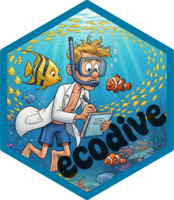

# ecodive 

<!-- badges: start
[](https://CRAN.R-project.org/package=ecodive)
[](https://anaconda.org/conda-forge/r-ecodive)
[](https://cranlogs.r-pkg.org/)
 -->
[](https://github.com/cmmr/ecodive/actions/workflows/R-CMD-check.yaml)
[](https://app.codecov.io/gh/cmmr/ecodive)
<!-- badges: end -->

`ecodive` provides the fastest implementations of alpha and beta diversity
metrics for R, including UniFrac, Faith's PD, Bray-Curtis, Shannon, and many
others. It works with any matrix-like object, including phyloseq, rbiom, and
BioConductor data structures. With zero dependencies, it's quick to install and
ideal for end users and package developers alike.


## Installation

The latest stable version can be installed from CRAN.

``` r
install.packages('ecodive')
```

The development version is available on GitHub.

``` r
install.packages('pak')
pak::pak('cmmr/ecodive')
```


## Usage

``` r

## Example Data ----------------------

counts <- rarefy(ex_counts)
counts
#>                   Saliva Gums Nose Stool
#> Streptococcus        162  309    6     1
#> Bacteroides            2    2    0   341
#> Corynebacterium        0    0  171     1
#> Haemophilus          180   34    0     1
#> Propionibacterium      1    0   82     0
#> Staphylococcus         0    0   86     1


## Alpha Diversity -------------------

shannon(counts)
#>     Saliva       Gums       Nose      Stool 
#> 0.74119910 0.35692121 1.10615349 0.07927797 

faith(counts, tree = ex_tree)
#> Saliva   Gums   Nose  Stool 
#>    180    155    101    202 


## Beta Diversity --------------------

bray_curtis(counts)
#>          Saliva      Gums      Nose
#> Gums  0.4260870                    
#> Nose  0.9797101 0.9826087          
#> Stool 0.9884058 0.9884058 0.9913043

weighted_unifrac(counts, tree = ex_tree)
#>          Saliva      Gums      Nose
#> Gums   36.97681                    
#> Nose   67.23768  55.97101          
#> Stool 109.77971 109.44058 110.00870
```


## Documentation

The online manual for `ecodive` is available at
<https://cmmr.github.io/ecodive/>. It includes a getting started guide,
articles on alpha/beta diversity, and reference pages for each function.


## Automated tests

The following commands will check if `ecodive` passes the bundled testing
suite.

``` r
install.packages('testthat')
testthat::test_check('ecodive')
```


## Community guidelines


### Support

Bug reports, feature requests, and general questions can be submitted at
<https://github.com/cmmr/ecodive/issues>.


### Contributing

Pull requests are welcome. Please ensure contributed code is covered by
tests and documentation (add additional tests and documentation as
needed) and passes all automated tests.

New functions should leverage C and pthreads to minimize memory and CPU time.

Please note that the ecodive project is released with a [Contributor Code of
Conduct](https://cmmr.github.io/ecodive/CODE_OF_CONDUCT.html). By contributing
to this project, you agree to abide by its terms.
