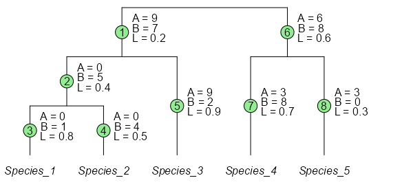

# UniFrac Calculations

## Introduction

The different UniFrac algorithms are listed below, along with examples
for calculating them.

  

## Input Data

- A numeric matrix with two samples and five species.
- A phylogenetic tree for those five species.

[TABLE]

  

## Definitions

The branch indices (green circles) are used for ordering the L, A, and B
arrays. Values for L are drawn from the input phylogenetic tree. Values
for A and B are the total number of species observations descending from
that branch; A for Sample_A, and B for Sample_B.

  

|                                                |                                  |
|------------------------------------------------|----------------------------------|
| n = 8                                          | Number of branches               |
| A = \\9, 0, 0, 0, 9, 6, 3, 3\\                 | Branch **weights** for Sample_A. |
| B = \\7, 5, 1, 4, 2, 8, 8, 0\\                 | Branch **weights** for Sample_B. |
| A_T = 15                                       | Total observations for Sample_A. |
| B_T = 15                                       | Total observations for Sample_B. |
| L = \\0.2, 0.4, 0.8, 0.5, 0.9, 0.6, 0.7, 0.3\\ | The branch **lengths**.          |

  

## Unweighted

- [Lozupone et al,
  2005](https://doi.org/10.1128/AEM.71.12.8228-8235.2005): Unweighted
  UniFrac
- R Package [ecodive](https://cran.r-project.org/package=ecodive):
  [`unweighted_unifrac()`](https://cmmr.github.io/ecodive/reference/bdiv_functions.md)
- R Package [abdiv](https://doi.org/10.32614/CRAN.package.abdiv):
  [`unweighted_unifrac()`](https://cmmr.github.io/ecodive/reference/bdiv_functions.md)
- R Package [phyloseq](https://doi.org/doi:10.18129/B9.bioc.phyloseq):
  `UniFrac(weighted=FALSE)`
- [qiime2](https://qiime2.org/)
  `qiime diversity beta-phylogenetic --p-metric unweighted_unifrac`
- [mothur](https://mothur.org/): `unifrac.unweighted()`

First, transform A and B into presence (1) and absence (0) indicators.

|                                                                                                   |                                                                                                   |
|---------------------------------------------------------------------------------------------------|---------------------------------------------------------------------------------------------------|
| \begin{align\*} A &= \\9, 0, 0, 0, 9, 6, 3, 3\\ \\ A' &= \\1, 0, 0, 0, 1, 1, 1, 1\\ \end{align\*} | \begin{align\*} B &= \\7, 5, 1, 4, 2, 8, 8, 0\\ \\ B' &= \\1, 1, 1, 1, 1, 1, 1, 0\\ \end{align\*} |

Then apply the formula:

\begin{align\*} U &= \displaystyle \frac{\sum\_{i = 1}^{n} L_i(\|A'\_i -
B'\_i\|)}{\sum\_{i = 1}^{n} L_i(max(A'\_i,B'\_i))} \\ \\ U &=
\displaystyle \frac{L_1(\|A'\_1-B'\_1\|) + L_2(\|A'\_2-B'\_2\|) +
\cdots + L_n(\|A'\_n-B'\_n\|)}{L_1(max(A'\_1,B'\_1)) +
L_2(max(A'\_2,B'\_2)) + \cdots + L_n(max(A'\_n,B'\_n))} \\ \\ U &=
\displaystyle \frac{0.2(\|1-1\|) + 0.4(\|0-1\|) + \cdots +
0.3(\|1-0\|)}{0.2(max(1,1)) + 0.4(max(0,1)) + \cdots + 0.3(max(1,0))} \\
\\ U &= \displaystyle \frac{0.2(0) + 0.4(1) + 0.8(1) + 0.5(1) + 0.9(0) +
0.6(0) + 0.7(0) + 0.3(1)}{0.2(1) + 0.4(1) + 0.8(1) + 0.5(1) + 0.9(1) +
0.6(1) + 0.7(1) + 0.3(1)} \\ \\ U &= \displaystyle \frac{0.4 + 0.8 +
0.5 + 0.3}{0.2 + 0.4 + 0.8 + 0.5 + 0.9 + 0.6 + 0.7 + 0.3} \\ \\ U &=
\displaystyle \frac{2}{4.4} \\ \\ U &= 0.4545455 \end{align\*}

## Weighted

- [Lozupone et al, 2007](https://doi.org/10.1128/AEM.01996-06): Raw
  Weighted UniFrac
- R Package [ecodive](https://cran.r-project.org/package=ecodive):
  [`weighted_unifrac()`](https://cmmr.github.io/ecodive/reference/bdiv_functions.md)
- R Package [abdiv](https://doi.org/10.32614/CRAN.package.abdiv):
  [`weighted_unifrac()`](https://cmmr.github.io/ecodive/reference/bdiv_functions.md)
- R Package [phyloseq](https://doi.org/doi:10.18129/B9.bioc.phyloseq):
  `UniFrac(weighted=TRUE, normalized=FALSE)`
- [qiime2](https://qiime2.org/)
  `qiime diversity beta-phylogenetic --p-metric weighted_unifrac`

\begin{align\*} W &= \sum\_{i = 1}^{n} L_i\|\frac{A_i}{A_T} -
\frac{B_i}{B_T}\| \\ \\ W &= L_1\|\frac{A_1}{A_T} - \frac{B_1}{B_T}\| +
L_2\|\frac{A_2}{A_T} - \frac{B_2}{B_T}\| + \cdots +
L_n\|\frac{A_n}{A_T} - \frac{B_n}{B_T}\| \\ \\ W &= 0.2\|\frac{9}{15} -
\frac{7}{15}\| + 0.4\|\frac{0}{15} - \frac{5}{15}\| + \cdots +
0.3\|\frac{3}{15} - \frac{0}{15}\| \\ \\ W &= 0.02\overline{6} +
0.1\overline{3} + 0.05\overline{3} + 0.1\overline{3} + 0.42 + 0.08 +
0.2\overline{3} + 0.06 \\ \\ W &= 1.14 \end{align\*}

## Normalized

- [Lozupone et al, 2007](https://doi.org/10.1128/AEM.01996-06):
  Normalized Weighted UniFrac
- R Package [ecodive](https://cran.r-project.org/package=ecodive):
  [`normalized_unifrac()`](https://cmmr.github.io/ecodive/reference/bdiv_functions.md)
- R Package [abdiv](https://doi.org/10.32614/CRAN.package.abdiv):
  `weighted_normalized_unifrac()`
- R Package [phyloseq](https://doi.org/doi:10.18129/B9.bioc.phyloseq):
  `UniFrac(weighted=TRUE, normalized=TRUE)`
- [qiime2](https://qiime2.org/)
  `qiime diversity beta-phylogenetic --p-metric weighted_normalized_unifrac`
- [mothur](https://mothur.org/): `unifrac.weighted()`

\begin{align\*} N &= \displaystyle \frac {\sum\_{i = 1}^{n}
L_i\|\frac{A_i}{A_T} - \frac{B_i}{B_T}\|} {\sum\_{i = 1}^{n}
L_i(\frac{A_i}{A_T} + \frac{B_i}{B_T})} \\ \\ N &= \displaystyle \frac
{L_1\|\frac{A_1}{A_T} - \frac{B_1}{B_T}\| + L_2\|\frac{A_2}{A_T} -
\frac{B_2}{B_T}\| + \cdots + L_n\|\frac{A_n}{A_T} - \frac{B_n}{B_T}\|}
{L_1(\frac{A_1}{A_T} + \frac{B_1}{B_T}) + L_2(\frac{A_2}{A_T} +
\frac{B_2}{B_T}) + \cdots + L_n(\frac{A_n}{A_T} + \frac{B_n}{B_T})} \\
\\ N &= \displaystyle \frac {0.2\|\frac{9}{15} - \frac{7}{15}\| +
0.4\|\frac{0}{15} - \frac{5}{15}\| + \cdots + 0.3\|\frac{3}{15} -
\frac{0}{15}\|} {0.2(\frac{9}{15} + \frac{7}{15}) + 0.4(\frac{0}{15} +
\frac{5}{15}) + \cdots + 0.3(\frac{3}{15} + \frac{0}{15})} \\ \\ N &=
\displaystyle \frac {0.02\overline{6} + 0.1\overline{3} +
0.05\overline{3} + 0.1\overline{3} + 0.42 + 0.08 + 0.2\overline{3} +
0.06} {0.21\overline{3} + 0.1\overline{3} + 0.05\overline{3} +
0.1\overline{3} + 0.66 + 0.56 + 0.51\overline{3} + 0.06} \\ \\ N &=
\displaystyle \frac{1.14}{2.326667} \\ \\ N &= 0.4899713 \end{align\*}

## Generalized

- [Chen et al. 2012](https://doi.org/10.1093/bioinformatics/bts342):
  Generalized UniFrac
- R Package [ecodive](https://cran.r-project.org/package=ecodive):
  `generalized_unifrac(alpha = 0.5)`
- R Package [abdiv](https://doi.org/10.32614/CRAN.package.abdiv):
  `generalized_unifrac(alpha = 0.5)`
- R Package [GUniFrac](https://doi.org/10.32614/CRAN.package.GUniFrac):
  `GUniFrac(alpha = 0.5)`
- [qiime2](https://qiime2.org/)
  `qiime diversity beta-phylogenetic --p-metric generalized_unifrac -a 0.5`

\begin{align\*} G &= \displaystyle \frac {\sum\_{i = 1}^{n}
L_i(\frac{A_i}{A_T} + \frac{B_i}{B_T})^{\alpha} \|\displaystyle \frac
{\frac{A_i}{A_T} - \frac{B_i}{B_T}} {\frac{A_i}{A_T} + \frac{B_i}{B_T}}
\|} {\sum\_{i = 1}^{n} L_i(\frac{A_i}{A_T} + \frac{B_i}{B_T})^{\alpha}}
\\ \\ G &= \displaystyle \frac { L_1(\frac{A_1}{A_T} +
\frac{B_1}{B_T})^{0.5} \|\displaystyle \frac {\frac{A_1}{A_T} -
\frac{B_1}{B_T}} {\frac{A_1}{A_T} + \frac{B_1}{B_T}}\| + \cdots +
L_n(\frac{A_n}{A_T} + \frac{B_n}{B_T})^{0.5} \|\displaystyle \frac
{\frac{A_n}{A_T} - \frac{B_n}{B_T}} {\frac{A_n}{A_T} +
\frac{B_n}{B_T}}\| }{ L_1(\frac{A_1}{A_T} + \frac{B_1}{B_T})^{0.5} +
\cdots + L_n(\frac{A_n}{A_T} + \frac{B_n}{B_T})^{0.5} } \\ \\ G &=
\displaystyle \frac { 0.2(\frac{9}{15} + \frac{7}{15})^{0.5}
\|\displaystyle \frac {\frac{9}{15} - \frac{7}{15}} {\frac{9}{15} +
\frac{7}{15}}\| + \cdots + 0.3(\frac{3}{15} + \frac{0}{15})^{0.5}
\|\displaystyle \frac {\frac{3}{15} - \frac{0}{15}} {\frac{3}{15} +
\frac{0}{15}}\| }{ 0.2(\frac{9}{15} + \frac{7}{15})^{0.5} + \cdots +
0.3(\frac{3}{15} + \frac{0}{15})^{0.5} } \\ \\ G &\approx \displaystyle
\frac {0.03 + 0.23 + 0.21 + 0.26 + 0.49 + 0.08 + 0.27 + 0.13} {0.21 +
0.23 + 0.21 + 0.26 + 0.77 + 0.58 + 0.60 + 0.13} \\ \\ G &= \displaystyle
\frac{1.701419}{2.986235} \\ \\ G &= 0.569754 \end{align\*}

## Variance Adjusted

- [Chang et al, 2011](https://doi.org/10.1186/1471-2105-12-118):
  Variance Adjusted Weighted (VAW) UniFrac
- R Package [ecodive](https://cran.r-project.org/package=ecodive):
  [`variance_adjusted_unifrac()`](https://cmmr.github.io/ecodive/reference/bdiv_functions.md)
- R Package [abdiv](https://doi.org/10.32614/CRAN.package.abdiv):
  [`variance_adjusted_unifrac()`](https://cmmr.github.io/ecodive/reference/bdiv_functions.md)
- [qiime2](https://qiime2.org/)
  `qiime diversity beta-phylogenetic --p-metric weighted_normalized_unifrac --p-variance-adjusted`

\begin{align\*} V &= \displaystyle \frac {\sum\_{i = 1}^{n}
L_i\displaystyle \frac {\|\frac{A_i}{A_T} - \frac{B_i}{B_T}\|}
{\sqrt{(A_i + B_i)(A_T + B_T - A_i - B_i)}} } {\sum\_{i = 1}^{n}
L_i\displaystyle \frac {\frac{A_i}{A_T} + \frac{B_i}{B_T}} {\sqrt{(A_i +
B_i)(A_T + B_T - A_i - B_i)}} } \\ \\ V &= \displaystyle \frac {
L_1\displaystyle \frac {\|\frac{A_1}{A_T} - \frac{B_1}{B_T}\|}
{\sqrt{(A_1 + B_1)(A_T + B_T - A_1 - B_1)}} + \cdots + L_n\displaystyle
\frac {\|\frac{A_n}{A_T} - \frac{B_n}{B_T}\|} {\sqrt{(A_n + B_n)(A_T +
B_T - A_n - B_n)}} }{ L_1\displaystyle \frac {\frac{A_1}{A_T} +
\frac{B_1}{B_T}} {\sqrt{(A_1 + B_1)(A_T + B_T - A_1 - B_1)}} + \cdots +
L_n\displaystyle \frac {\frac{A_n}{A_T} + \frac{B_n}{B_T}} {\sqrt{(A_n +
B_n)(A_T + B_T - A_n - B_n)}} } \\ \\ V &= \displaystyle \frac {
0.2\displaystyle \frac {\|\frac{9}{15} - \frac{7}{15}\|} {\sqrt{(9 +
7)(15 + 15 - 9 - 7)}} + \cdots + 0.3\displaystyle \frac
{\|\frac{3}{15} - \frac{0}{15}\|} {\sqrt{(3 + 0)(15 + 15 - 3 - 0)}} }{
0.2\displaystyle \frac {\frac{9}{15} + \frac{7}{15}} {\sqrt{(9 + 7)(15 +
15 - 9 - 7)}} + \cdots + 0.3\displaystyle \frac {\frac{3}{15} +
\frac{0}{15}} {\sqrt{(3 + 0)(15 + 15 - 3 - 0)}} } \\ \\ V &\approx
\displaystyle \frac {0.002 + 0.012 + 0.010 + 0.013 + 0.029 + 0.005 +
0.016 + 0.007} {0.014 + 0.012 + 0.010 + 0.013 + 0.046 + 0.037 + 0.036 +
0.007} \\ \\ V &= \displaystyle \frac{4.09389}{4.174402} \\ \\ V &=
0.9807128 \end{align\*}
