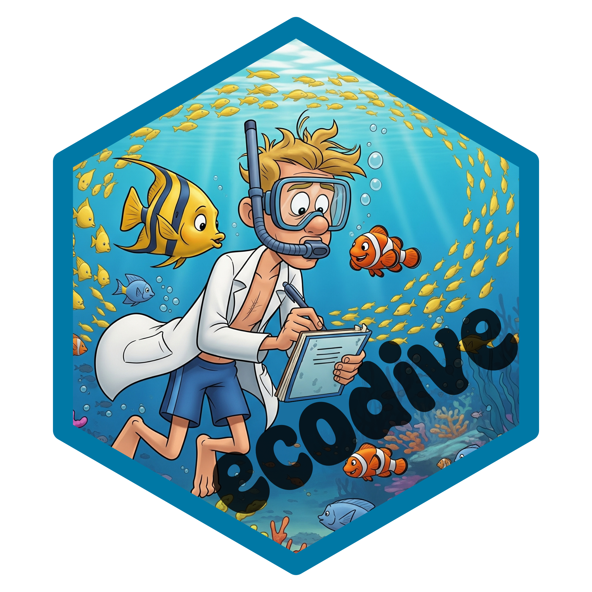
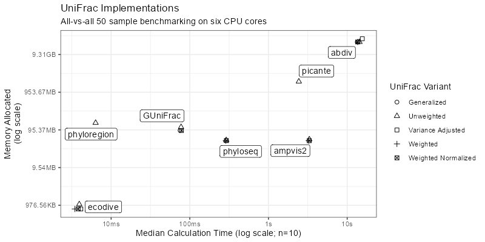
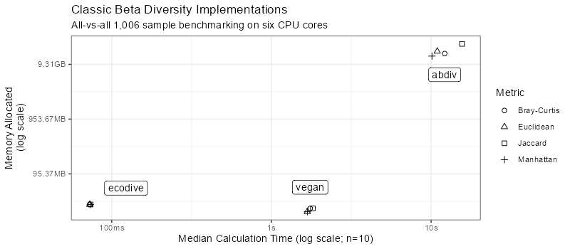
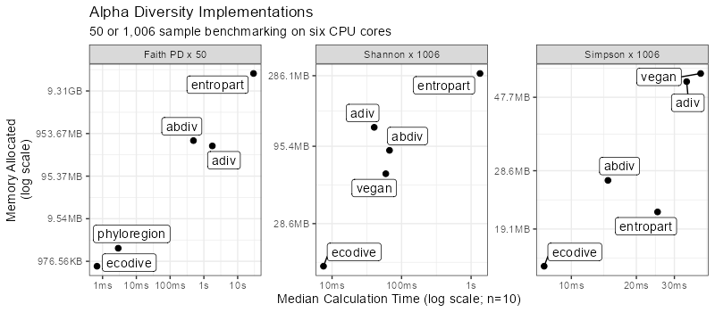

{height="150pt"}

# Summary

In the context of ecology, diversity measures the distribution of different
species within in a community. This calculation may include the number of
species present, relative abundances, evolutionary relationships, or a
combination thereof. Alpha diversity metrics consider a single community in
isolation, whereas beta diversity metrics compute the dissimilarity between two
communities.

Applying diversity metrics to large collections of communities, for instance
thousands of gut microbiome samples, can offer insights into how specific
disease states may be predicted or diagnosed based on ecological "fingerprints".

# Statement of Need

Some diversity metrics, such as Faith's PD [@FaithPD] and UniFrac [@UniFrac],
require complex integration species counts with evolutionary distances.
Furthermore, processing thousands of communities is computationally intensive
and best implemented with parallel processing and compiled libraries. For these
reasons, the ecodive R package was developed to handle these challenges so that
R users don't have to.

## Related Works

There are currently five other R packages that can calculate alpha and beta
diversity metrics: abdiv [@abdiv], ampvis2 [@ampvis2], GUniFrac [@GUniFrac],
phyloseq [@phyloseq], and vegan [@vegan]. However, ecodive provides an
implementation which is both faster and more memory efficient.

The bench R package [@bench] was used to compare abdiv, ampvis2, ecodive,
GUniFrac, phyloseq, and vegan. The benchmarking runs are detailed in the
benchmark vignette, which is available from within R with
`vignette('benchmark')` and online at
<https://cmmr.github.io/ecodive/articles/benchmark.html>.

# Acknowledgements

# References
