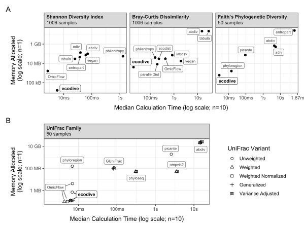

```{r, include = FALSE}
knitr::opts_chunk$set(
  collapse = TRUE,
  comment = "#>"
)
```


# Introduction

### State of the Field

This analysis provides a comparative benchmark of R packages designed for
calculating standard and phylogenetic metrics of alpha and beta diversity. The
primary objective is to evaluate their computational efficiency, with a focus on
processing speed and memory allocation. Packages that rely on these foundational
libraries as dependencies have been omitted from this study to isolate the
performance of the core implementations.


| R Package               | Classic alpha/beta      | Phylogenetic alpha/beta |
|:------------------------|:------------------------|:------------------------|
| [abdiv](https://doi.org/10.32614/CRAN.package.abdiv)               0.2.0  | ***Serial R***       | *none*             |
| [adiv](https://doi.org/10.32614/CRAN.package.adiv)                 2.2.1  | ***Serial R***       | ***Serial R***     |
| [ampvis2](https://github.com/KasperSkytte/ampvis2)                 2.8.11 | vegan                | ***Serial R***     |
| [ecodist](https://doi.org/10.32614/CRAN.package.ecodist)           2.1.3  | ***Serial C/R***     | *none*             |
| [ecodive](https://doi.org/10.32614/CRAN.package.ecodive)           2.2.6  | ***Parallel C***     | ***Parallel C***   |
| [entropart](https://doi.org/10.32614/CRAN.package.entropart)       1.6-16 | ***Serial R***       | *none*             |
| [GUniFrac](https://doi.org/10.32614/CRAN.package.GUniFrac)         1.9    | *none*               | ***Serial C***     |
| [labdsv](https://doi.org/10.32614/CRAN.package.labdsv)             2.3-1  | ***Serial FORTRAN*** | *none*             |
| [OmicFlow](https://doi.org/10.32614/CRAN.package.OmicFlow)         1.5.1  | ***Parallel C++***   | ***Parallel C++*** |
| [parallelDist](https://doi.org/10.32614/CRAN.package.parallelDist) 0.2.7  | ***Parallel C++***   | *none*             |
| [philentropy](https://doi.org/10.32614/CRAN.package.philentropy)   0.10.0 | ***Parallel C++***   | *none*             |
| [phyloregion](https://doi.org/10.32614/CRAN.package.phyloregion)   1.0.9  | vegan                | ***Serial R***     |
| [phyloseq](https://doi.org/doi:10.18129/B9.bioc.phyloseq)          1.56.0 | vegan                | ***Parallel R***   |
| [picante](https://doi.org/10.32614/CRAN.package.picante)           1.8.2  | vegan                | ***Serial R***     |
| [tabula](https://doi.org/10.32614/CRAN.package.tabula)             3.3.2  | ***Serial R***       | *none*             |
| [vegan](https://doi.org/10.32614/CRAN.package.vegan)               2.7-3  | ***Serial C***       | *none*             |


### Methodology

The `bench` R package was employed to quantify the computational runtime and
memory allocation for the diversity algorithms within each of the 15 selected
packages. All benchmarks were executed on a host system with the following
hardware and software configuration:

    CPU: 6-Core Intel i5-9600K @ 3.70GHz
    RAM: 64.0 GB
    OS: Windows 11 Pro (64-bit, Version 25H2, Build 26200.8246)

Furthermore, the `bench::mark()` function was utilized to verify that the
outputs from all benchmarked expressions were numerically equivalent, ensuring
the consistency and comparability of the results.


<br>


# Setup

Two standard datasets from the `rbiom` R package, `hmp50` and `gems`, were
selected for this evaluation. The `hmp50` dataset, which includes 50 samples and
an associated phylogenetic tree, was used to benchmark the computationally
intensive phylogenetic metrics, such as UniFrac and Faith's PD. For the
traditional diversity metrics, which are significantly less demanding, the
larger `gems` dataset, comprising 1,006 samples, was employed.

To account for the heterogeneous input and output formats across the 15 R
packages, necessary data transformations were performed. To ensure that the
benchmarks exclusively measured the performance of the diversity calculations,
these data conversion steps were executed outside of the timed code blocks
whenever possible.

<details>
  <summary>Click to reveal R code.</summary>

```r
install.packages('pak')

# Tools and Datasets for Benchmarking Report
pak::pkg_install(pkg = c(
  'bench', 'dplyr', 'ggplot2', 'ggrepel', 'rbiom', 'svglite' ))

# Diversity Metric Implementations
pak::pkg_install(pkg = c(
  'abdiv', 'adiv', 'ecodist', 'ecodive', 'entropart', 'GUniFrac', 
  'kasperskytte/ampvis2', 'labdsv', 'OmicFlow', 'parallelDist', 
  'philentropy', 'phyloregion', 'phyloseq', 'picante', 'tabula', 'vegan' ))


# Software Versions

version$version.string
#> [1] "R version 4.6.0 (2026-04-24 ucrt)"

data.frame(ver = sapply(FUN = packageDescription, fields = 'Version', c(
  'bench', 'dplyr', 'ggplot2', 'ggrepel', 'rbiom',
  'abdiv', 'adiv', 'ecodist', 'ecodive', 'entropart', 'GUniFrac', 
  'ampvis2', 'labdsv', 'OmicFlow', 'parallelDist', 'philentropy', 
  'phyloregion', 'phyloseq', 'picante', 'tabula', 'vegan' )))
#>                 ver
#> bench         1.1.4
#> dplyr         1.2.1
#> ggplot2       4.0.3
#> ggrepel       0.9.8
#> rbiom         3.1.0
#> abdiv         0.2.0
#> adiv          2.2.1
#> ecodist       2.1.3
#> ecodive       2.2.6
#> entropart    1.6-16
#> GUniFrac        1.9
#> ampvis2      2.8.11
#> labdsv        2.3-1
#> OmicFlow      1.5.1
#> parallelDist  0.2.7
#> philentropy  0.10.0
#> phyloregion   1.0.9
#> phyloseq     1.56.0
#> picante       1.8.2
#> tabula        3.3.2
#> vegan         2.7-3

library(bench)
library(ggplot2)
library(ggrepel)
library(dplyr)
library(Matrix)


n_cpus <- ecodive::n_cpus()
print(n_cpus)
#> [1] 6

# for philentropy
RcppParallel::setThreadOptions(numThreads = n_cpus)


# abdiv only accepts two samples at a time
pairwise <- function (f, data, ...) {
  pairs <- utils::combn(nrow(data), 2)
  structure(
    mapply(
      FUN = function (i, j) f(data[i,], data[j,], ...), 
      i   = pairs[1,], j = pairs[2,] ),
    class  = 'dist',
    Labels = rownames(data),
    Size   = nrow(data),
    Diag   = FALSE,
    Upper  = FALSE )
}


# Remove any extraneous attributes from dist objects,
# allowing them to be compared with `all.equal()`.
cleanup <- function (x) {
  for (i in setdiff(names(attributes(x)), c('class', 'Labels', 'Size', 'Diag', 'Upper')))
    attr(x, i) <- NULL
  return (x)
}


# HMP50 dataset has 50 samples
hmp50        <- rbiom::hmp50
hmp50$counts <- hmp50$counts[hmp50$tree$tip.label,]
hmp50_phy    <- rbiom::convert_to_phyloseq(hmp50)
hmp50_mtx_t  <- as.matrix(hmp50)
hmp50_mtx    <- t(hmp50_mtx_t)
hmp50_mtx_pt <- apply(hmp50_mtx, 1L, function (x) x / sum(x))
hmp50_mtx_p  <- t(hmp50_mtx_pt)
hmp50_dgC    <- as(hmp50_mtx,    'dgCMatrix')
hmp50_dgC_t  <- as(hmp50_mtx_t,  'dgCMatrix')
hmp50_dgC_pt <- as(hmp50_mtx_pt, 'dgCMatrix')
hmp50_tree   <- hmp50$tree

# GEMS dataset has 1006 samples
gems        <- rbiom::gems
gems_mtx_t  <- as.matrix(gems)
gems_mtx    <- t(gems_mtx_t)
gems_mtx_pt <- apply(gems_mtx, 1L, function (x) x / sum(x))
gems_mtx_p  <- t(gems_mtx_pt)
gems_dgC_t  <- as(gems_mtx_t,  'dgCMatrix')
gems_dgC_pt <- as(gems_mtx_pt, 'dgCMatrix')
gems_bool   <- gems_mtx > 0


## Bray-Curtis Dissimilarity
bray_curtis_res <- bench::mark(
  iterations = 10,
  'abdiv'        = cleanup(pairwise(abdiv::bray_curtis, gems_mtx)),
  'ecodist'      = cleanup(ecodist::bcdist(gems_mtx)),
  'ecodive'      = cleanup(ecodive::bray(gems_dgC_t, margin = 2)),
  'labdsv'       = cleanup(labdsv::dsvdis(gems_mtx, 'bray/curtis')),
  'OmicFlow'     = cleanup(OmicFlow::bray(gems_dgC_t, threads=n_cpus)),
  'parallelDist' = cleanup(parallelDist::parallelDist(gems_mtx, 'bray')),
  'philentropy'  = cleanup(philentropy::distance(gems_mtx, 'sorensen', test.na = FALSE, use.row.names = TRUE, as.dist.obj = TRUE, mute.message = TRUE)),
  'tabula'       = cleanup(1 - pairwise(tabula::index_bray, gems_mtx)),
  'vegan'        = cleanup(vegan::vegdist(gems_mtx, 'bray')) )

print(bray_curtis_res[,1:9] %>% arrange(median))
#> # A tibble: 9 × 9
#>   expression        min   median `itr/sec` mem_alloc `gc/sec` n_itr  n_gc total_time
#>   <bch:expr>   <bch:tm> <bch:tm>     <dbl> <bch:byt>    <dbl> <int> <dbl>   <bch:tm>
#> 1 ecodive       19.25ms  19.68ms   50.5       3.92MB    0        10     0   197.88ms
#> 2 philentropy  159.63ms  161.3ms    6.21     38.87MB    0        10     0      1.61s
#> 3 parallelDist 194.45ms 197.64ms    5.03       7.8MB    0        10     0      1.99s
#> 4 OmicFlow     228.11ms 231.81ms    4.17     28.97MB    0        10     0       2.4s
#> 5 ecodist      433.57ms 436.77ms    2.28     29.44MB    0        10     0      4.38s
#> 6 labdsv       830.26ms 848.67ms    1.08     68.12MB    0        10     0      9.22s
#> 7 vegan           1.97s    1.98s    0.503    16.45MB    0        10     0     19.88s
#> 8 abdiv          14.57s    15.2s    0.0655   20.43GB    0.472    10    72      2.54m
#> 9 tabula         27.66s    29.2s    0.0340   20.44GB    0.238    10    70      4.91m


## Jaccard Distance
jaccard_res <- bench::mark(
  iterations = 10,
  'abdiv'        = cleanup(pairwise(abdiv::jaccard, gems_mtx)),
  'ecodist'      = cleanup(ecodist::distance(gems_mtx, 'jaccard')),
  'ecodive'      = cleanup(ecodive::jaccard(gems_dgC_t, margin = 2)),
  'OmicFlow'     = cleanup(OmicFlow::jaccard(gems_dgC_t, weighted = FALSE, threads=n_cpus)),
  'parallelDist' = cleanup(parallelDist::parallelDist(gems_mtx, 'binary')),
  'philentropy'  = cleanup(philentropy::distance(gems_bool, 'jaccard', test.na = FALSE, use.row.names = TRUE, as.dist.obj = TRUE, mute.message = TRUE)),
  'phyloregion'  = cleanup(phyloregion::beta_diss(gems_mtx, 'jaccard')$beta.jac),
  'stats'        = cleanup(stats::dist(gems_mtx, 'binary')),
  'vegan'        = cleanup(vegan::vegdist(gems_mtx, 'jaccard', binary = TRUE)) )

print(jaccard_res[,1:9] %>% arrange(median))
#> # A tibble: 9 × 9
#>   expression        min   median `itr/sec` mem_alloc `gc/sec` n_itr  n_gc total_time
#>   <bch:expr>   <bch:tm> <bch:tm>     <dbl> <bch:byt>    <dbl> <int> <dbl>   <bch:tm>
#> 1 ecodive       16.77ms  17.28ms  57.5        3.87MB   0         10     0    173.9ms
#> 2 phyloregion  136.46ms 137.73ms   7.24     194.64MB   0         10     0      1.38s
#> 3 philentropy  175.83ms 177.32ms   5.58      41.64MB   0         10     0      1.79s
#> 4 parallelDist  314.2ms 316.97ms   3.15       7.71MB   0         10     0      3.18s
#> 5 OmicFlow     339.03ms 342.38ms   2.92      29.29MB   0         10     0      3.42s
#> 6 vegan           1.87s     1.9s   0.519     63.68MB   0         10     0     19.25s
#> 7 stats           2.88s    2.89s   0.346      7.73MB   0         10     0     28.91s
#> 8 abdiv           38.3s    1.28m   0.0120    24.89GB   0.0227    10    19     13.93m
#> 9 ecodist         2.06m    2.19m   0.00746   47.89GB   0.0738    10    99     22.36m


## Manhattan Distance
manhattan_res <- bench::mark(
  iterations = 10,
  'abdiv'        = cleanup(pairwise(abdiv::manhattan, gems_mtx)),
  'ecodist'      = cleanup(ecodist::distance(gems_mtx, 'manhattan')),
  'ecodive'      = cleanup(ecodive::manhattan(gems_dgC_t, norm = 'none', margin = 2)),
  'OmicFlow'     = cleanup(OmicFlow::manhattan(gems_dgC_t, threads=n_cpus)),
  'parallelDist' = cleanup(parallelDist::parallelDist(gems_mtx, 'manhattan')),
  'philentropy'  = cleanup(philentropy::distance(gems_mtx, 'manhattan', test.na = FALSE, use.row.names = TRUE, as.dist.obj = TRUE, mute.message = TRUE)),
  'stats'        = cleanup(stats::dist(gems_mtx, 'manhattan')),
  'vegan'        = cleanup(vegan::vegdist(gems_mtx, 'manhattan')) )

print(manhattan_res[,1:9] %>% arrange(median))
#> # A tibble: 8 × 9
#>   expression        min   median `itr/sec` mem_alloc `gc/sec` n_itr  n_gc total_time
#>   <bch:expr>   <bch:tm> <bch:tm>     <dbl> <bch:byt>    <dbl> <int> <dbl>   <bch:tm>
#> 1 ecodive       20.74ms  21.12ms  47.1        3.86MB  0          10     0   212.18ms
#> 2 philentropy  152.21ms 153.46ms   6.50      38.69MB  0          10     0      1.54s
#> 3 parallelDist 159.71ms 163.01ms   6.10       7.71MB  0          10     0      1.64s
#> 4 OmicFlow     218.88ms 221.43ms   4.52      28.97MB  0          10     0      2.21s
#> 5 vegan            1.7s    1.71s   0.585      13.5MB  0          10     0     17.11s
#> 6 stats           2.33s    2.34s   0.427      7.71MB  0          10     0     23.43s
#> 7 ecodist        33.88s    1.27m   0.0137     21.8GB  0.0603     10    44     12.17m
#> 8 abdiv           1.65m    2.21m   0.00751   17.52GB  0.00901    10    12      22.2m


## Euclidean Distance
euclidean_res <- bench::mark(
  iterations = 10,
  'abdiv'        = cleanup(pairwise(abdiv::euclidean, gems_mtx)),
  'ecodist'      = cleanup(ecodist::distance(gems_mtx, 'euclidean')),
  'ecodive'      = cleanup(ecodive::euclidean(gems_dgC_t, norm = 'none', margin = 2)),
  'parallelDist' = cleanup(parallelDist::parallelDist(gems_mtx, 'euclidean')),
  'philentropy'  = cleanup(philentropy::distance(gems_mtx, 'euclidean', test.na = FALSE, use.row.names = TRUE, as.dist.obj = TRUE, mute.message = TRUE)),
  'stats'        = cleanup(stats::dist(gems_mtx, 'euclidean')),
  'vegan'        = cleanup(vegan::vegdist(gems_mtx, 'euclidean')) )

print(euclidean_res[,1:9] %>% arrange(median))
#> # A tibble: 7 × 9
#>   expression        min   median `itr/sec` mem_alloc `gc/sec` n_itr  n_gc total_time
#>   <bch:expr>   <bch:tm> <bch:tm>     <dbl> <bch:byt>    <dbl> <int> <dbl>   <bch:tm>
#> 1 ecodive       20.66ms     21ms  47.3        3.86MB   0         10     0   211.44ms
#> 2 philentropy  151.73ms 154.51ms   6.45      38.69MB   0         10     0      1.55s
#> 3 parallelDist 160.26ms 161.71ms   6.16       7.71MB   0         10     0      1.62s
#> 4 vegan            1.7s    1.71s   0.584      13.5MB   0         10     0     17.13s
#> 5 stats           2.35s    2.35s   0.423      7.71MB   0         10     0     23.62s
#> 6 abdiv           1.38m     1.5m   0.0106    17.52GB   0.0255    10    24     15.67m
#> 7 ecodist         1.19m    1.56m   0.00946    21.8GB   0.0397    10    42     17.62m

## Shannon Diversity Index
shannon_res <- bench::mark(
  iterations = 10,
  'abdiv'       = apply(gems_mtx_p, 1L, abdiv::shannon),
  'adiv'        = adiv::speciesdiv(gems_mtx_p, 'Shannon')[,1],
  'ecodive'     = ecodive::shannon(gems_dgC_pt, margin = 2),
  'entropart'   = apply(gems_mtx_p, 1L, entropart::Shannon, CheckArguments = FALSE),
  'OmicFlow'    = OmicFlow::diversity(gems_dgC_t, metric = 'shannon'),
  'philentropy' = apply(gems_mtx_p, 1L, philentropy::H, unit = 'log'),
  'tabula'      = apply(gems_mtx_p, 1L, tabula::index_shannon),
  'vegan'       = vegan::diversity(gems_mtx_p, 'shannon') )

print(shannon_res[,1:9] %>% arrange(median))
#> # A tibble: 8 × 9
#>   expression       min   median `itr/sec` mem_alloc `gc/sec` n_itr  n_gc total_time
#>   <bch:expr>  <bch:tm> <bch:tm>     <dbl> <bch:byt>    <dbl> <int> <dbl>   <bch:tm>
#> 1 OmicFlow      2.67ms   2.74ms   363.       1.57MB    0        10     0    27.55ms
#> 2 ecodive       5.76ms   5.95ms   166.      15.97KB    0        10     0    60.19ms
#> 3 tabula       25.12ms  25.44ms    39.2     28.17MB    0        10     0   254.82ms
#> 4 entropart    36.97ms  37.44ms    26.7     41.77MB    0        10     0   374.71ms
#> 5 adiv         38.84ms  39.64ms    25.2    125.31MB    0        10     0   396.53ms
#> 6 vegan        61.02ms  61.38ms    16.3     68.08MB    0        10     0   614.84ms
#> 7 abdiv        71.28ms  71.72ms    13.7     95.38MB    0        10     0    731.2ms
#> 8 philentropy    1.28s    1.28s     0.780   52.67MB    0.780     5     5      6.41s


## Gini-Simpson Index
simpson_res <- bench::mark(
  iterations = 10,
  'abdiv'     = apply(gems_mtx_p, 1L, abdiv::simpson),
  'adiv'      = adiv::speciesdiv(gems_mtx_p, 'GiniSimpson')[,1],
  'ecodive'   = ecodive::simpson(gems_dgC_pt, margin = 2),
  'entropart' = apply(gems_mtx_p, 1L, entropart::Simpson, CheckArguments = FALSE),
  'OmicFlow'  = OmicFlow::diversity(gems_dgC_t, metric = 'simpson'),
  'tabula'    = 1 - apply(gems_mtx_p, 1L, tabula::index_simpson),
  'vegan'     = vegan::diversity(gems_mtx_p, 'simpson') )

print(simpson_res[,1:9] %>% arrange(median))
#> # A tibble: 7 × 9
#>   expression      min   median `itr/sec` mem_alloc `gc/sec` n_itr  n_gc total_time
#>   <bch:expr> <bch:tm> <bch:tm>     <dbl> <bch:byt>    <dbl> <int> <dbl>   <bch:tm>
#> 1 OmicFlow    817.4µs 861.75µs    1081.     1.11MB        0    10     0     9.25ms
#> 2 ecodive      5.93ms   6.26ms     144.    14.56KB        0    10     0    69.48ms
#> 3 abdiv       16.89ms  17.01ms      58.8   32.64MB        0    10     0   169.99ms
#> 4 tabula      21.66ms  21.98ms      45.5   27.57MB        0    10     0   219.87ms
#> 5 adiv        31.14ms  31.29ms      30.8   50.24MB        0    10     0   324.17ms
#> 6 vegan       37.29ms  37.73ms      26.4   62.15MB        0    10     0    378.1ms
#> 7 entropart   38.98ms  39.28ms      25.5   47.54MB        0    10     0   392.49ms


## Faith's Phylogenetic Diversity
faith_res <- bench::mark(
  iterations = 10,
  check         = FALSE, # entropart has incorrect output on non-ultrametric tree
  'abdiv'       = apply(hmp50_mtx, 1L, abdiv::faith_pd, hmp50_tree),
  'adiv'        = apply(hmp50_mtx, 1L, \(x) adiv::EH(hmp50_tree, colnames(hmp50_mtx)[x > 0])),
  'ecodive'     = ecodive::faith(hmp50_dgC_t, hmp50_tree, margin = 2),
  'entropart'   = apply(hmp50_mtx, 1L, entropart::PDFD, hmp50_tree, CheckArguments = FALSE),
  'phyloregion' = phyloregion::PD(hmp50_mtx, hmp50_tree),
  'picante'     = as.matrix(picante::pd(hmp50_mtx, hmp50_tree))[,'PD'] )

print(faith_res[,1:9] %>% arrange(median))
#> # A tibble: 6 × 9
#>   expression       min   median `itr/sec` mem_alloc `gc/sec` n_itr  n_gc total_time
#>   <bch:expr>  <bch:tm> <bch:tm>     <dbl> <bch:byt>    <dbl> <int> <dbl>   <bch:tm>
#> 1 ecodive       2.62ms   2.83ms  346.      594.52KB   0         10     0     28.9ms
#> 2 phyloregion  13.92ms  14.43ms   68.0       1.54MB   0         10     0    147.1ms
#> 3 picante      91.96ms   92.7ms   10.7      69.57MB   0         10     0    934.6ms
#> 4 abdiv          1.19s    4.46s    0.251   651.56MB   0.0251    10     1      39.8s
#> 5 adiv           2.19s    5.34s    0.172   489.08MB   0.0172    10     1      58.3s
#> 6 entropart     43.55s     1.1m    0.0154   23.95GB   0.0508    10    33      10.8m


## Unweighted UniFrac
u_unifrac_res <- rbind(
  
  local({
    # cluster for phyloseq
    cl <- parallel::makeCluster(n_cpus)
    doParallel::registerDoParallel(cl)
    on.exit(parallel::stopCluster(cl))
    
    bench::mark(
      iterations    = 10,
      'abdiv'       = cleanup(pairwise(abdiv::unweighted_unifrac, hmp50_mtx, hmp50_tree)),
      'ecodive'     = cleanup(ecodive::unweighted_unifrac(hmp50_dgC_t, hmp50_tree, margin = 2)),
      'GUniFrac'    = cleanup(as.dist(GUniFrac::GUniFrac(hmp50_mtx, hmp50_tree, alpha=1, verbose=FALSE)[[1]][,,2])),
      'OmicFlow'    = cleanup(OmicFlow::unifrac(hmp50_dgC_pt, hmp50_tree, weighted=FALSE, threads=n_cpus)),
      'phyloregion' = cleanup(phyloregion::unifrac(hmp50_dgC, hmp50_tree)),
      'phyloseq'    = cleanup(phyloseq::UniFrac(hmp50_phy, weighted=FALSE, normalized=FALSE, parallel=TRUE)),
      'picante'     = cleanup(picante::unifrac(hmp50_mtx, hmp50_tree)) )
  }),
  
  # ampvis2 conflicts with phyloseq cluster, so run separately
  local({
    bench::mark(
      iterations = 10,
      'ampvis2'  = {
        cleanup(ampvis2:::dist.unifrac(hmp50_mtx_t, hmp50_tree, weighted=FALSE, normalise=FALSE, num_threads=n_cpus))
        doParallel::stopImplicitCluster() } )
  })
)

print(u_unifrac_res[,1:9] %>% arrange(median))
#> # A tibble: 8 × 9
#>   expression       min   median `itr/sec` mem_alloc `gc/sec` n_itr  n_gc total_time
#>   <bch:expr>  <bch:tm> <bch:tm>     <dbl> <bch:byt>    <dbl> <int> <dbl>   <bch:tm>
#> 1 ecodive       6.22ms   6.89ms  115.      697.21KB   0         10     0    86.61ms
#> 2 phyloregion   6.61ms   6.92ms  145.      150.43MB   0         10     0       69ms
#> 3 OmicFlow      6.69ms   6.98ms  141.        4.05MB   0         10     0    70.84ms
#> 4 GUniFrac     82.55ms  84.11ms   10.6     114.09MB   2.12      10     2   943.09ms
#> 5 phyloseq    311.95ms 317.52ms    3.02     50.87MB   0.302     10     1      3.31s
#> 6 picante        2.51s    2.58s    0.381      1.8GB   1.22      10    32     26.22s
#> 7 ampvis2        3.52s    3.61s    0.277    54.18MB   0.0308     9     1     32.44s
#> 8 abdiv         14.45s   14.79s    0.0655   20.06GB   2.46      10   375      2.54m


## Weighted UniFrac
w_unifrac_res <- rbind(
  
  local({
    # cluster for phyloseq
    cl <- parallel::makeCluster(n_cpus)
    doParallel::registerDoParallel(cl)
    on.exit(parallel::stopCluster(cl))
    
    bench::mark(
      iterations = 10,
      'abdiv'    = cleanup(pairwise(abdiv::weighted_unifrac, hmp50_mtx, hmp50_tree)),
      'ecodive'  = cleanup(ecodive::weighted_unifrac(hmp50_dgC_t, hmp50_tree, margin=2)),
      'OmicFlow' = cleanup(OmicFlow::unifrac(hmp50_dgC_pt, hmp50_tree, weighted=TRUE, normalized=FALSE, threads=n_cpus)),
      'phyloseq' = cleanup(phyloseq::UniFrac(hmp50_phy, weighted=TRUE, normalized=FALSE, parallel=TRUE)) )
  }),
  
  # ampvis2 conflicts with phyloseq cluster, so run separately
  local({
    bench::mark(
      iterations = 10,
      'ampvis2'  = {
        cleanup(ampvis2:::dist.unifrac(hmp50_mtx_t, hmp50_tree, weighted=TRUE, normalise=FALSE, num_threads=n_cpus))
        doParallel::stopImplicitCluster() } )
  })
)

print(w_unifrac_res[,1:9] %>% arrange(median))
#> # A tibble: 5 × 9
#>   expression      min   median `itr/sec` mem_alloc `gc/sec` n_itr  n_gc total_time
#>   <bch:expr> <bch:tm> <bch:tm>     <dbl> <bch:byt>    <dbl> <int> <dbl>   <bch:tm>
#> 1 OmicFlow     4.09ms   4.31ms  228.        98.7KB   0         10     0    43.83ms
#> 2 ecodive      6.02ms   6.25ms  160.       117.4KB   0         10     0    62.66ms
#> 3 phyloseq   302.25ms 305.79ms    3.24      49.4MB   0.324     10     1      3.09s
#> 4 ampvis2       3.47s    3.51s    0.278     49.2MB   0.0309     9     1     32.33s
#> 5 abdiv        14.33s   14.39s    0.0661      20GB   2.06      10   311      2.52m


## Weighted Normalized UniFrac
wn_unifrac_res <- rbind(
  
  local({
    # cluster for phyloseq
    cl <- parallel::makeCluster(n_cpus)
    doParallel::registerDoParallel(cl)
    on.exit(parallel::stopCluster(cl))
    
    bench::mark(
      iterations = 10,
      'abdiv'    = cleanup(pairwise(abdiv::weighted_normalized_unifrac, hmp50_mtx, hmp50_tree)),
      'ecodive'  = cleanup(ecodive::normalized_unifrac(hmp50_dgC_t, hmp50_tree, margin=2)),
      'GUniFrac' = cleanup(as.dist(GUniFrac::GUniFrac(hmp50_mtx, hmp50_tree, alpha=1, verbose=FALSE)[[1]][,,1])),
      'OmicFlow' = cleanup(OmicFlow::unifrac(hmp50_dgC_pt, hmp50_tree, weighted=TRUE, normalized=TRUE, threads=n_cpus)),
      'phyloseq' = cleanup(phyloseq::UniFrac(hmp50_phy, weighted=TRUE, normalized=TRUE, parallel=TRUE)) )
  }),
  
  # ampvis2 conflicts with phyloseq cluster, so run separately
  local({
    bench::mark(
      iterations = 10,
      'ampvis2'  = {
        cleanup(ampvis2:::dist.unifrac(hmp50_mtx_t, hmp50_tree, weighted=TRUE, normalise=TRUE, num_threads=n_cpus))
        doParallel::stopImplicitCluster() } )
  })
)

print(wn_unifrac_res[,1:9] %>% arrange(median))
#> # A tibble: 6 × 9
#>   expression      min   median `itr/sec` mem_alloc `gc/sec` n_itr  n_gc total_time
#>   <bch:expr> <bch:tm> <bch:tm>     <dbl> <bch:byt>    <dbl> <int> <dbl>   <bch:tm>
#> 1 OmicFlow     4.56ms    5.2ms  185.        98.7KB   0         10     0    53.95ms
#> 2 ecodive      6.01ms   6.37ms  156.       117.4KB   0         10     0    63.97ms
#> 3 GUniFrac    80.62ms  83.63ms   11.2       92.1MB   1.12      10     1   895.17ms
#> 4 phyloseq   302.16ms 318.88ms    3.07      49.5MB   0.307     10     1      3.25s
#> 5 ampvis2       3.57s    3.69s    0.264     49.3MB   0.0293     9     1     34.14s
#> 6 abdiv        14.08s   14.37s    0.0662      20GB   1.38      10   208      2.52m


## Generalized UniFrac
g_unifrac_res <- rbind(
  
  local({
    # cluster for phyloseq
    cl <- parallel::makeCluster(n_cpus)
    doParallel::registerDoParallel(cl)
    on.exit(parallel::stopCluster(cl))
    
    bench::mark(
      iterations = 10,
      'abdiv'    = cleanup(pairwise(abdiv::generalized_unifrac, hmp50_mtx, hmp50_tree, alpha=0.5)),
      'ecodive'  = cleanup(ecodive::generalized_unifrac(hmp50_dgC_t, hmp50_tree, margin=2, alpha=0.5)),
      'GUniFrac' = cleanup(as.dist(GUniFrac::GUniFrac(hmp50_mtx, hmp50_tree, alpha=0.5, verbose=FALSE)[[1]][,,1])) )
  })
)

print(g_unifrac_res[,1:9] %>% arrange(median))
#> # A tibble: 3 × 9
#>   expression      min   median `itr/sec` mem_alloc `gc/sec` n_itr  n_gc total_time
#>   <bch:expr> <bch:tm> <bch:tm>     <dbl> <bch:byt>    <dbl> <int> <dbl>   <bch:tm>
#> 1 ecodive      6.54ms   7.26ms  119.       129.5KB     0       10     0    83.72ms
#> 2 GUniFrac    79.56ms  80.82ms   11.6       92.1MB     1.16    10     1   864.08ms
#> 3 abdiv        14.24s   14.76s    0.0664    20.2GB     1.37    10   207      2.51m


## Variance Adjusted UniFrac
va_unifrac_res <- rbind(
  
  local({
    # cluster for phyloseq
    cl <- parallel::makeCluster(n_cpus)
    doParallel::registerDoParallel(cl)
    on.exit(parallel::stopCluster(cl))
    
    bench::mark(
      iterations = 10,
      'abdiv'    = cleanup(pairwise(abdiv::variance_adjusted_unifrac, hmp50_mtx, hmp50_tree)),
      'ecodive'  = cleanup(ecodive::variance_adjusted_unifrac(hmp50_dgC_t, hmp50_tree, margin=2)) )
  })
)

print(va_unifrac_res[,1:9] %>% arrange(median))
#> # A tibble: 2 × 9
#>   expression      min   median `itr/sec` mem_alloc `gc/sec` n_itr  n_gc total_time
#>   <bch:expr> <bch:tm> <bch:tm>     <dbl> <bch:byt>    <dbl> <int> <dbl>   <bch:tm>
#> 1 ecodive      6.03ms   6.29ms  159.       117.4KB     0       10     0    62.85ms
#> 2 abdiv        16.12s   16.25s    0.0583    24.5GB     1.15    10   197      2.86m


## Data frame for Figure 1A
Fig1A_data <- bind_rows(
    mutate(shannon_res,     Metric = 'shannon'),
    mutate(bray_curtis_res, Metric = 'bray'),
    mutate(faith_res,       Metric = 'faith') ) %>%
  mutate(Package = as.character(expression)) %>%
  select(Package, Metric, median, mem_alloc) %>%
  arrange(Metric, median)


Fig1A_data$Title <- factor(
  x      = Fig1A_data$Metric, 
  levels = c("shannon", "bray", "faith"), 
  labels = c(
    "**Shannon Diversity Index**<br>1006 samples", 
    "**Bray-Curtis Dissimilarity**<br>1006 samples", 
    "**Faith's Phylogenetic Diversity**<br>50 samples") )


## ggplot for Figure 1A
Fig1A <- ggplot(Fig1A_data, aes(x = median, y = mem_alloc)) +
    facet_wrap('Title', nrow = 1, scales = 'free_x') + 
    geom_point() +
    geom_label_repel(aes(
        label    = Package,
        alpha    = ifelse(Package == 'ecodive', 1, 0.6),
        fontface = ifelse(Package == 'ecodive', 2, 1),
        size     = ifelse(Package == 'ecodive', 3.2, 2.6) ), 
      box.padding        = .4,
      point.padding      = .5,
      max.overlaps       = Inf,
      min.segment.length = 0 ) + 
    scale_alpha_identity(guide = 'none') +
    scale_size_identity(guide = 'none') +
    bench::scale_x_bench_time() +
    scale_y_log10(labels = scales::label_bytes()) +
    labs(
      tag = 'A',
      x   = 'Median Calculation Time (log scale; n=10)', 
      y   = 'Memory Allocated\n(log scale; n=1)' ) +
    theme_bw(base_size = 12) +
    theme(
      strip.text   = ggtext::element_markdown(hjust = 0, lineheight = 1.2),
      axis.title.x = element_text(margin = margin(t = 10)))


## Data frame for Figure 1B
Fig1B_data <- bind_rows(
    mutate(u_unifrac_res,  `UniFrac Variant` = 'Unweighted'),
    mutate(w_unifrac_res,  `UniFrac Variant` = 'Weighted'),
    mutate(wn_unifrac_res, `UniFrac Variant` = 'Weighted Normalized'),
    mutate(g_unifrac_res,  `UniFrac Variant` = 'Generalized'),
    mutate(va_unifrac_res, `UniFrac Variant` = 'Variance Adjusted') ) %>%
  mutate(Package = as.character(expression)) %>%
  select(Package, `UniFrac Variant`, median, mem_alloc) %>%
  arrange(Package)

Fig1B_data$Title <- "**UniFrac Family**<br>50 samples"
Fig1B_data$`UniFrac Variant` <- factor(
  x      = Fig1B_data$`UniFrac Variant`, 
  levels = c("Unweighted", "Weighted", "Weighted Normalized", "Generalized", "Variance Adjusted") )


## ggplot for Figure 1B
Fig1B <- ggplot(Fig1B_data, aes(x = median, y = mem_alloc)) +
  facet_wrap('Title') + 
  geom_point(aes(shape = `UniFrac Variant`), size = 2) +
  geom_label_repel(aes(
      label    = Package, 
      alpha    = ifelse(Package == 'ecodive', 1, 0.6),
      fontface = ifelse(Package == 'ecodive', 2, 1),
      size     = ifelse(Package == 'ecodive', 3.2, 2.6) ),
    data          = ~subset(., `UniFrac Variant` == 'Unweighted'),
    direction     = 'y', 
    box.padding   = 0.4,
    point.padding = 10,
    min.segment.length = Inf ) + 
  scale_shape(solid = FALSE) + 
  scale_alpha_identity(guide = 'none') +
  scale_size_identity(guide = 'none') +
  bench::scale_x_bench_time(limits = c(.002, NA)) +
  scale_y_log10(labels = scales::label_bytes()) +
  labs(
    tag = 'B',
    x   = 'Median Calculation Time (log scale; n=10)', 
    y   = 'Memory Allocated\n(log scale; n=1)' ) +
  theme_bw(base_size = 12) +
  theme(
    strip.text   = ggtext::element_markdown(hjust = 0, lineheight = 1.2),
    axis.title.x = element_text(margin = margin(t = 10)) )


## Combined Figure 1
Fig1 <- patchwork::wrap_plots(
  Fig1A, 
  Fig1B, 
  patchwork::guide_area(), 
  design = "111\n223", 
  guides = 'collect' )
```

</details>


# Results

```r
print(Fig1)
```

```{r out.width = "98%", echo=FALSE}
  
```


## How much faster and more memory efficient is ecodive?

```r
plyr::ddply(Fig1A_data, as.name('Metric'), function (x) {
  x[['median']]    <- as.numeric(x[['median']])
  x[['mem_alloc']] <- as.numeric(x[['mem_alloc']])
  ecodive <- as.list(x[x[['Package']] == 'ecodive',])
  x       <- x[x[['Package']] != 'ecodive',]
  data.frame(
    speed  = paste0(paste(collapse=' - ', round(range(x$median    / ecodive$median))), 'x'),
    memory = paste0(paste(collapse=' - ', round(range(x$mem_alloc / ecodive$mem_alloc))), 'x') )
})

#>    Metric        speed         memory
#> 1    bray    8 - 1368x      2 - 5232x
#> 2   faith   1 - 14022x   119 - 41624x
#> 3 shannon     0 - 235x     96 - 7963x


plyr::ddply(Fig1B_data, as.name('UniFrac Variant'), function (x) {
  x[['median']]    <- as.numeric(x[['median']])
  x[['mem_alloc']] <- as.numeric(x[['mem_alloc']])
  ecodive <- as.list(x[x[['Package']] == 'ecodive',])
  x       <- x[x[['Package']] != 'ecodive',]
  data.frame(
    speed  = paste0(paste(collapse=' - ', round(range(x$median    / ecodive$median))), 'x'),
    memory = paste0(paste(collapse=' - ', round(range(x$mem_alloc / ecodive$mem_alloc))), 'x') )
})
#>       UniFrac Variant          speed             memory
#> 1          Unweighted      1 - 2147x         6 - 30163x
#> 2            Weighted      1 - 2302x        1 - 178809x
#> 3 Weighted Normalized      1 - 2257x        1 - 178890x
#> 4         Generalized     11 - 2033x      729 - 163456x
#> 5   Variance Adjusted   2584 - 2584x   218449 - 218449x
```


## Raw Data for Figure 1 Panel A

```r
print(Fig1A_data[,1:4], n = Inf)
#> # A tibble: 23 × 4
#>    Package      Metric    median mem_alloc
#>    <chr>        <chr>   <bch:tm> <bch:byt>
#>  1 ecodive      bray     19.34ms       4MB
#>  2 philentropy  bray    159.94ms   38.87MB
#>  3 parallelDist bray    193.92ms     7.8MB
#>  4 OmicFlow     bray    229.82ms   28.98MB
#>  5 ecodist      bray    434.13ms   29.44MB
#>  6 labdsv       bray    849.94ms   68.16MB
#>  7 vegan        bray       1.97s   16.45MB
#>  8 abdiv        bray      14.63s   20.44GB
#>  9 tabula       bray      26.47s   20.44GB
#> 10 ecodive      faith     2.05ms   603.3KB
#> 11 phyloregion  faith     3.06ms  146.19MB
#> 12 picante      faith    82.04ms   69.86MB
#> 13 abdiv        faith   567.87ms  651.64MB
#> 14 adiv         faith      1.94s  489.12MB
#> 15 entropart    faith     28.76s   23.95GB
#> 16 OmicFlow     shannon   2.32ms    1.57MB
#> 17 ecodive      shannon   5.73ms   16.71KB
#> 18 tabula       shannon  26.02ms   28.17MB
#> 19 entropart    shannon  38.98ms   41.79MB
#> 20 adiv         shannon  41.17ms  129.96MB
#> 21 vegan        shannon  63.01ms   68.08MB
#> 22 abdiv        shannon  73.23ms   95.38MB
#> 23 philentropy  shannon    1.35s   52.67MB
```


## Raw Data for Figure 1 Panel B

```r
print(Fig1B_data[,1:4], n = Inf)
#> # A tibble: 24 × 4
#>    Package     `UniFrac Variant`     median mem_alloc
#>    <chr>       <fct>               <bch:tm> <bch:byt>
#>  1 GUniFrac    Unweighted           84.11ms  114.09MB
#>  2 GUniFrac    Weighted Normalized  83.63ms   92.14MB
#>  3 GUniFrac    Generalized          80.82ms   92.14MB
#>  4 OmicFlow    Unweighted            6.98ms    4.05MB
#>  5 OmicFlow    Weighted              4.31ms   98.66KB
#>  6 OmicFlow    Weighted Normalized    5.2ms   98.66KB
#>  7 abdiv       Unweighted            14.79s   20.06GB
#>  8 abdiv       Weighted              14.39s   20.02GB
#>  9 abdiv       Weighted Normalized   14.37s   20.03GB
#> 10 abdiv       Generalized           14.76s   20.19GB
#> 11 abdiv       Variance Adjusted     16.25s   24.46GB
#> 12 ampvis2     Unweighted             3.61s   54.18MB
#> 13 ampvis2     Weighted               3.51s   49.19MB
#> 14 ampvis2     Weighted Normalized    3.69s   49.34MB
#> 15 ecodive     Unweighted            6.89ms  697.21KB
#> 16 ecodive     Weighted              6.25ms  117.42KB
#> 17 ecodive     Weighted Normalized   6.37ms  117.42KB
#> 18 ecodive     Generalized           7.26ms  129.49KB
#> 19 ecodive     Variance Adjusted     6.29ms  117.42KB
#> 20 phyloregion Unweighted            6.92ms  150.43MB
#> 21 phyloseq    Unweighted          317.52ms   50.87MB
#> 22 phyloseq    Weighted            305.79ms   49.39MB
#> 23 phyloseq    Weighted Normalized 318.88ms   49.54MB
#> 24 picante     Unweighted             2.58s     1.8GB
```


## Number of Dependencies per Package

```r
data.frame(deps = sapply(
  FUN = function (pkg) { nrow(pak::pkg_deps(pkg)) - 1 },
  X   = c(
  'abdiv', 'adiv', 'ecodist', 'ecodive', 'entropart', 'GUniFrac', 
  'kasperskytte/ampvis2', 'labdsv', 'OmicFlow', 'parallelDist', 
  'philentropy', 'phyloregion', 'phyloseq', 'picante', 'tabula', 'vegan' )))

#>                      deps
#> abdiv                   5
#> adiv                   97
#> ecodist                10
#> ecodive                 0
#> entropart              82
#> GUniFrac               47
#> kasperskytte/ampvis2   75
#> labdsv                  8
#> OmicFlow               90
#> parallelDist            2
#> philentropy             4
#> phyloregion            64
#> phyloseq               54
#> picante                11
#> tabula                  2
#> vegan                   7
```

## Metrics per Package

The following prompt was provided to Google Gemini 3's "Thinking" model for each package:

```
I am analyzing the [PACKAGE_NAME] R package to compare the number of ecologically relevant alpha and beta diversity metrics it provides. The package's reference manual is attached. 

Please act as an expert in ecological bioinformatics. Carefully read the manual and adhere to these rules:

1. DEFINITION OF A SUITABLE METRIC:
   - ECOLOGICAL RELEVANCE: Only include metrics used to quantify community diversity. This includes measures of richness, evenness, dominance, turnover, or nestedness.
   - SYMMETRY REQUIREMENT: Strictly ignore any asymmetric metrics (where $d(a, b) \neq d(b, a)$). All included beta diversity metrics must be symmetric.
   - EXCLUSIONS: Do NOT count accessory functions, data manipulation, plotting functions, or general statistical correlations (e.g., Pearson/Spearman) unless they are explicitly implemented as a community diversity or dissimilarity index.

2. DISTINCTNESS RULE:
   - ARGUMENTS AS METRICS: If a single function computes different named metrics based on a character argument (e.g., `method="bray"` vs `method="jaccard"`), each valid method counts as a SEPARATE metric.
   - NAMED METRIC SELECTORS: If a numeric parameter (like q, alpha, or p) is used to dial in specific named indices (e.g., q=0 for Richness, q=1 for Shannon, q=2 for Simpson, or phylogenetic equivalents like Faith's PD, Allen's H, and Rao's Q), count each named case as a distinct metric. Do not count intermediate or arbitrary numeric values.
   - THE BINARY TOGGLE: Treat the presence-absence version and abundance-based version of the same metric as ONE entity, unless they are provided as separate functions or separate named methods in a list.
   - UNIFRAC EXCEPTION: Count unweighted, weighted, weighted normalized, generalized, and variance-adjusted UniFrac as separate metrics if explicitly supported.

3. CATEGORIZATION:
   - ALPHA DIVERSITY: Metrics that quantify the diversity of a single sample or site (inventory diversity).
   - BETA DIVERSITY: Metrics that quantify the difference or dissimilarity between a pair of samples (differentiation diversity).

To ensure accuracy, format your response as follows:

- **Candidate Extraction:** List all potential diversity functions and their associated methods/parameters found in the manual.
- **Evaluation:** Filter the candidates against the "Symmetry," "Ecological Relevance," and "Distinctness" rules.
- **Categorized Metric List:** Provide a table or list of all validated metrics with two columns: [Metric Name] and [Category (Alpha or Beta)].
- **Final Summary:**
    - **Total Alpha Diversity Metrics:** [Integer]
    - **Total Beta Diversity Metrics:** [Integer]
    - **UniFrac Metrics Present:** [Yes/No]
```


| R Package      | Alpha |  Beta |   Unifrac    |
|:---------------|------:|------:|--------------|
| `abdiv`        |    17 |    48 | $\checkmark$ |
| `adiv`         |    42 |    58 | $-$          |
| `ampvis2`      |     6 |    25 | $\checkmark$ |
| `ecodist`      |     0 |     9 | $-$          |
| `ecodive`      |    14 |    36 | $\checkmark$ |
| `entropart`    |    11 |     9 | $-$          |
| `GUniFrac`     |     0 |     4 | $\checkmark$ |
| `labdsv`       |     2 |     7 | $-$          |
| `OmicFlow`     |     6 |     9 | $\checkmark$ |
| `parallelDist` |     0 |    26 | $-$          |
| `philentropy`  |     1 |    43 | $-$          |
| `phyloregion`  |     9 |    10 | $\checkmark$ |
| `phyloseq`     |     7 |    43 | $\checkmark$ |
| `picante`      |    14 |     9 | $\checkmark$ |
| `tabula`       |    16 |    12 | $-$          |
| `vegan`        |    17 |    52 | $-$          |


