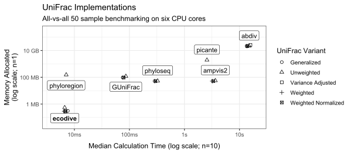

```{r, include = FALSE}
knitr::opts_chunk$set(
  collapse = TRUE,
  comment = "#>"
)
```


# Introduction

### State of the Field

This analysis provides a comparative benchmark of R packages designed for
calculating standard and phylogenetic metrics of alpha and beta diversity. The
primary objective is to evaluate their computational efficiency, with a focus on
processing speed and memory allocation. Packages that rely on these foundational
libraries as dependencies have been omitted from this study to isolate the
performance of the core implementations.


| R Package               | Classic alpha/beta      | Phylogenetic alpha/beta |
|:------------------------|:------------------------|:------------------------|
| [abdiv](https://doi.org/10.32614/CRAN.package.abdiv)               | ***Serial R***       | *none*             |
| [adiv](https://doi.org/10.32614/CRAN.package.adiv)                 | ***Serial R***       | ***Serial R***     |
| [ampvis2](https://github.com/KasperSkytte/ampvis2)                 | vegan                | ***Serial R***     |
| [ecodist](https://doi.org/10.32614/CRAN.package.ecodist)           | ***Serial C/R***     | *none*             |
| [ecodive](https://doi.org/10.32614/CRAN.package.ecodive)           | ***Parallel C***     | ***Parallel C***   |
| [entropart](https://doi.org/10.32614/CRAN.package.entropart)       | ***Serial R***       | *none*             |
| [GUniFrac](https://doi.org/10.32614/CRAN.package.GUniFrac)         | *none*               | ***Serial C***     |
| [labdsv](https://doi.org/10.32614/CRAN.package.labdsv)             | ***Serial FORTRAN*** | *none*             |
| [parallelDist](https://doi.org/10.32614/CRAN.package.parallelDist) | *none*               | ***Parallel C++*** |
| [philentropy](https://doi.org/10.32614/CRAN.package.philentropy)   | ***Serial C++***     | *none*             |
| [phyloregion](https://doi.org/10.32614/CRAN.package.phyloregion)   | vegan                | ***Serial R***     |
| [phyloseq](https://doi.org/doi:10.18129/B9.bioc.phyloseq)          | vegan                | ***Parallel R***   |
| [picante](https://doi.org/10.32614/CRAN.package.picante)           | vegan                | ***Serial R***     |
| [tabula](https://doi.org/10.32614/CRAN.package.tabula)             | ***Serial R***       | *none*             |
| [vegan](https://doi.org/10.32614/CRAN.package.vegan)               | ***Serial C***       | *none*             |


### Methodology

The `bench` R package was employed to quantify the computational runtime and
memory allocation for the diversity algorithms within each of the 15 selected
packages. All benchmarks were executed on a host system with the following
hardware and software configuration:

    CPU: 6-Core Intel i5-9600K @ 3.70GHz
    RAM: 64.0 GB
    OS: Windows 11 Pro (64-bit, Version 24H2, Build 26100.4652)

Furthermore, the `bench::mark()` function was utilized to verify that the
outputs from all benchmarked expressions were numerically equivalent, ensuring
the consistency and comparability of the results.


<br>


# Setup

Two standard datasets from the `rbiom` R package, `hmp50` and `gems`, were
selected for this evaluation. The `hmp50` dataset, which includes 50 samples and
an associated phylogenetic tree, was used to benchmark the computationally
intensive phylogenetic metrics, such as UniFrac and Faith's PD. For the
traditional diversity metrics, which are significantly less demanding, the
larger `gems` dataset, comprising 1,006 samples, was employed.

To account for the heterogeneous input and output formats across the 15 R
packages, necessary data transformations were performed. To ensure that the
benchmarks exclusively measured the performance of the diversity calculations,
these data conversion steps were executed outside of the timed code blocks
whenever possible.

<details>
  <summary>Click to reveal R code.</summary>

```r
install.packages('pak')

# Tools and Datasets for Benchmarking Report
pak::pkg_install(pkg = c(
  'bench', 'dplyr', 'ggplot2', 'ggrepel', 'rbiom', 'svglite' ))

# Diversity Metric Implementations
pak::pkg_install(pkg = c(
  'abdiv', 'adiv', 'ecodist', 'ecodive', 'entropart', 'GUniFrac', 
  'kasperskytte/ampvis2', 'labdsv', 'parallelDist', 'philentropy', 
  'phyloregion', 'phyloseq', 'picante', 'tabula', 'vegan' ))


# Software Versions

version$version.string
#> [1] "R version 4.5.1 (2025-06-13 ucrt)"

data.frame(ver = sapply(FUN = packageDescription, fields = 'Version', c(
  'bench', 'dplyr', 'ggplot2', 'ggrepel', 'rbiom',
  'abdiv', 'adiv', 'ecodist', 'ecodive', 'entropart', 'GUniFrac', 
  'ampvis2', 'labdsv', 'parallelDist', 'philentropy', 
  'phyloregion', 'phyloseq', 'picante', 'tabula', 'vegan' )))
#>                     ver
#> bench             1.1.4
#> dplyr             1.1.4
#> ggplot2           3.5.2
#> ggrepel           0.9.6
#> rbiom             2.2.1
#> abdiv             0.2.0
#> adiv              2.2.1
#> ecodist           2.1.3
#> ecodive           1.0.1
#> entropart        1.6-16
#> GUniFrac            1.8
#> ampvis2           2.8.9
#> labdsv            2.1-2
#> parallelDist      0.2.6
#> philentropy       0.9.0
#> phyloregion       1.0.9
#> phyloseq         1.52.0
#> picante           1.8.2
#> tabula            3.3.1
#> vegan             2.7-1

library(bench)
library(ggplot2)
library(ggrepel)
library(dplyr)

(n_cpus <- ecodive::n_cpus())
#> [1] 6

# abdiv only accepts two samples at a time
pairwise <- function (f, data, ...) {
  pairs <- utils::combn(nrow(data), 2)
  structure(
    mapply(
      FUN = function (i, j) f(data[i,], data[j,], ...), 
      i   = pairs[1,], j = pairs[2,] ),
    class  = 'dist',
    Labels = colnames(data),
    Size   = nrow(data),
    Diag   = FALSE,
    Upper  = FALSE )
}


# Remove any extraneous attributes from dist objects,
# allowing them to be compared with `all.equal()`.
cleanup <- function (x) {
  for (i in setdiff(names(attributes(x)), c('class', 'Labels', 'Size', 'Diag', 'Upper')))
    attr(x, i) <- NULL
  return (x)
}


# HMP50 dataset has 50 Samples
hmp50      <- rbiom::hmp50
hmp50_phy  <- rbiom::convert_to_phyloseq(hmp50)
hmp50_mtx  <- t(rbiom::rescale_cols(as.matrix(hmp50)))
hmp50_tree <- hmp50$tree


# GEMS dataset has 1006 Samples
gems_mtx <- t(rbiom::rescale_cols(as.matrix(rbiom::gems)))
```

</details>

<br>


# UniFrac

This section evaluates the computational performance of several UniFrac
implementations across seven R packages: `abdiv`, `ampvis2`, `ecodive`,
`GUniFrac`, `phyloseq`, `phyloregion`, and `picante.` The comparison includes
the unweighted, weighted, normalized weighted, generalized, and
variance-adjusted variants of the UniFrac metric. To establish a robust measure
of processing speed, each function was benchmarked across ten replicate runs,
while memory usage was profiled from a single execution.

<details>
  <summary>Click to reveal R code.</summary>
  
```r

## Unweighted UniFrac
u_unifrac_res <- rbind(
  
  local({
    # cluster for phyloseq
    cl <- parallel::makeCluster(n_cpus)
    doParallel::registerDoParallel(cl)
    on.exit(parallel::stopCluster(cl))
    
    bench::mark(
      iterations    = 10,
      'abdiv'       = cleanup(pairwise(abdiv::unweighted_unifrac, hmp50_mtx, hmp50_tree)),
      'ecodive'     = cleanup(ecodive::unweighted_unifrac(hmp50_mtx, hmp50_tree)),
      'GUniFrac'    = cleanup(as.dist(GUniFrac::GUniFrac(hmp50_mtx, hmp50_tree, alpha=1, verbose=FALSE)[[1]][,,2])),
      'phyloregion' = cleanup(phyloregion::unifrac(hmp50_mtx, hmp50_tree)),
      'phyloseq'    = cleanup(phyloseq::UniFrac(hmp50_phy, weighted=FALSE, normalized=FALSE, parallel=TRUE)),
      'picante'     = cleanup(picante::unifrac(hmp50_mtx, hmp50_tree)) )
  }),
  
  # ampvis2 conflicts with phyloseq cluster, so run separately
  local({
    t_hmp50_mtx <- t(hmp50_mtx)
    bench::mark(
      iterations = 10,
      'ampvis2'  = {
        cleanup(ampvis2:::dist.unifrac(t_hmp50_mtx, hmp50_tree, weighted=FALSE, normalise=FALSE, num_threads=n_cpus))
        doParallel::stopImplicitCluster() } )
  })
)

u_unifrac_res[,1:9]
#> # A tibble: 7 × 9
#>   expression       min   median `itr/sec` mem_alloc `gc/sec` n_itr  n_gc total_time
#>   <bch:expr>  <bch:tm> <bch:tm>     <dbl> <bch:byt>    <dbl> <int> <dbl>   <bch:tm>
#> 1 abdiv         14.59s      15s    0.0655    20.1GB   2.92      10   446      2.54m
#> 2 ecodive       6.36ms   6.66ms  148.       532.6KB   0         10     0    67.79ms
#> 3 GUniFrac      79.4ms  86.15ms   10.6      113.4MB   2.11      10     2   947.45ms
#> 4 phyloregion   6.96ms    7.1ms  139.       145.9MB   0         10     0    71.95ms
#> 5 phyloseq    306.89ms 325.11ms    2.85      50.9MB   0.571     10     2       3.5s
#> 6 picante        2.53s    2.56s    0.389      1.8GB   1.52      10    39     25.68s
#> 7 ampvis2        3.21s    3.64s    0.278     53.7MB   0.0309     9     1     32.34s

ggplot(u_unifrac_res, aes(x = median, y = mem_alloc)) +
  geom_point() +
  geom_label_repel(aes(label = as.character(expression))) + 
  labs(
    title = 'Unweighted UniFrac Implementations',
    subtitle = '50 sample all-vs-all benchmarking on six CPU cores',
    x = 'Median Calculation Time (log scale; n=10)', 
    y = 'Memory Allocated\n(log scale)' ) +
  theme_bw()
  
  
## Weighted UniFrac
w_unifrac_res <- rbind(
  
  local({
    # cluster for phyloseq
    cl <- parallel::makeCluster(n_cpus)
    doParallel::registerDoParallel(cl)
    on.exit(parallel::stopCluster(cl))
    
    bench::mark(
      iterations = 10,
      'abdiv'    = cleanup(pairwise(abdiv::weighted_unifrac, hmp50_mtx, hmp50_tree)),
      'ecodive'  = cleanup(ecodive::weighted_unifrac(hmp50_mtx, hmp50_tree)),
      'phyloseq' = cleanup(phyloseq::UniFrac(hmp50_phy, weighted=TRUE, normalized=FALSE, parallel=TRUE)) )
  }),
  
  # ampvis2 conflicts with phyloseq cluster, so run separately
  local({
    t_hmp50_mtx <- t(hmp50_mtx)
    bench::mark(
      iterations = 10,
      'ampvis2'  = {
        cleanup(ampvis2:::dist.unifrac(t_hmp50_mtx, hmp50_tree, weighted=TRUE, normalise=FALSE, num_threads=n_cpus))
        doParallel::stopImplicitCluster() } )
  })
)


## Weighted Normalized UniFrac
wn_unifrac_res <- rbind(
  
  local({
    # cluster for phyloseq
    cl <- parallel::makeCluster(n_cpus)
    doParallel::registerDoParallel(cl)
    on.exit(parallel::stopCluster(cl))
    
    bench::mark(
      iterations = 10,
      'abdiv'    = cleanup(pairwise(abdiv::weighted_normalized_unifrac, hmp50_mtx, hmp50_tree)),
      'ecodive'  = cleanup(ecodive::normalized_unifrac(hmp50_mtx, hmp50_tree)),
      'GUniFrac' = cleanup(as.dist(GUniFrac::GUniFrac(hmp50_mtx, hmp50_tree, alpha=1, verbose=FALSE)[[1]][,,1])),
      'phyloseq' = cleanup(phyloseq::UniFrac(hmp50_phy, weighted=TRUE, normalized=TRUE, parallel=TRUE)) )
  }),
  
  # ampvis2 conflicts with phyloseq cluster, so run separately
  local({
    t_hmp50_mtx <- t(hmp50_mtx)
    bench::mark(
      iterations = 10,
      'ampvis2'  = {
        cleanup(ampvis2:::dist.unifrac(t_hmp50_mtx, hmp50_tree, weighted=TRUE, normalise=TRUE, num_threads=n_cpus))
        doParallel::stopImplicitCluster() } )
  })
)


## Weighted Normalized UniFrac
g_unifrac_res <- rbind(
  
  local({
    # cluster for phyloseq
    cl <- parallel::makeCluster(n_cpus)
    doParallel::registerDoParallel(cl)
    on.exit(parallel::stopCluster(cl))
    
    bench::mark(
      iterations = 10,
      'abdiv'    = cleanup(pairwise(abdiv::generalized_unifrac, hmp50_mtx, hmp50_tree, alpha=0.5)),
      'ecodive'  = cleanup(ecodive::generalized_unifrac(hmp50_mtx, hmp50_tree, alpha=0.5)),
      'GUniFrac' = cleanup(as.dist(GUniFrac::GUniFrac(hmp50_mtx, hmp50_tree, alpha=0.5, verbose=FALSE)[[1]][,,1])) )
  })
)


## Variance Adjusted UniFrac
va_unifrac_res <- rbind(
  
  local({
    # cluster for phyloseq
    cl <- parallel::makeCluster(n_cpus)
    doParallel::registerDoParallel(cl)
    on.exit(parallel::stopCluster(cl))
    
    bench::mark(
      iterations = 10,
      'abdiv'    = cleanup(pairwise(abdiv::variance_adjusted_unifrac, hmp50_mtx, hmp50_tree)),
      'ecodive'  = cleanup(ecodive::variance_adjusted_unifrac(hmp50_mtx, hmp50_tree)) )
  })
)


unifrac_res <- bind_rows(
    mutate(u_unifrac_res,  `UniFrac Variant` = 'Unweighted'),
    mutate(w_unifrac_res,  `UniFrac Variant` = 'Weighted'),
    mutate(wn_unifrac_res, `UniFrac Variant` = 'Weighted Normalized'),
    mutate(g_unifrac_res,  `UniFrac Variant` = 'Generalized'),
    mutate(va_unifrac_res, `UniFrac Variant` = 'Variance Adjusted') ) %>%
  mutate(Package = as.character(expression)) %>%
  select(Package, `UniFrac Variant`, median, mem_alloc) %>%
  arrange(Package)
  
saveRDS(unifrac_res, 'benchmark/unifrac_res.rds')
```

```{r out.width = "98%", fig.width = '800px', fig.height = '350px'}
# unifrac_res <- readRDS('../benchmark/unifrac_res.rds')

# print(unifrac_res, n = Inf)
# 
# 
# # How much faster and more memory efficient is ecodive?
# plyr::ddply(unifrac_res, as.name('UniFrac Variant'), function (x) {
#   x[['median']]    <- as.numeric(x[['median']])
#   x[['mem_alloc']] <- as.numeric(x[['mem_alloc']])
#   ecodive <- as.list(x[x[['Package']] == 'ecodive',])
#   x       <- x[x[['Package']] != 'ecodive',]
#   data.frame(
#     speed  = paste0(paste(collapse=' - ', round(range(x$median    / ecodive$median))), 'x'),
#     memory = paste0(paste(collapse=' - ', round(range(x$mem_alloc / ecodive$mem_alloc))), 'x') )
# })


# ggplot(unifrac_res, aes(x = median, y = mem_alloc)) +
#   geom_point(aes(shape = `UniFrac Variant`), size = 2) +
#   geom_label_repel(
#     data          = ~subset(., `UniFrac Variant` == 'Unweighted'),
#     mapping       = aes(label = Package, fontface = ifelse(Package == 'ecodive', 2, 1)),
#     direction     = 'y', 
#     box.padding   = 0.4,
#     point.padding = 10,
#     seed          = 2,
#     min.segment.length = Inf ) + 
#   scale_shape(solid = FALSE) + 
#   bench::scale_x_bench_time(limits = c(.004, 20), breaks = c(.01, .1, 1, 10)) +
#   scale_y_log10(limits = 10^c(4.5,11.5), labels = scales::label_bytes()) +
#   labs(
#     title = 'UniFrac Implementations',
#     subtitle = 'All-vs-all 50 sample benchmarking on six CPU cores',
#     x = 'Median Calculation Time (log scale; n=10)', 
#     y = 'Memory Allocated\n(log scale; n=1)' ) +
#   theme_bw(base_size = 12) +
#   theme(axis.title.x = element_text(margin = margin(t = 10)))
```

</details>

```{r out.width = "98%", echo=FALSE}
  
```

`ecodive` demonstrates substantial performance gains for UniFrac, being 1 to 2,300x faster and using 90 - 90,000x less memory.
<br>


# Classic Beta Diversity

This section assesses the computational performance of functions for calculating
several traditional beta diversity metrics, including Bray-Curtis, Euclidean,
Jaccard, and Manhattan distances. The evaluation covers implementations from
nine R packages: `abdiv`, `ecodist`, `ecodive`, `labdsv`, `parallelDist`,
`philentropy`, `tabula`, `stats`, and `vegan.` Following the established
protocol, processing speed was measured across ten replicate runs, while a
single run was used to profile memory consumption.


<details>
  <summary>Click to reveal R code.</summary>

```r
bray_curtis_res <- bench::mark(
  iterations = 10,
  'abdiv'        = cleanup(pairwise(abdiv::bray_curtis, gems_mtx)),
  'ecodist'      = cleanup(ecodist::bcdist(gems_mtx)),
  'ecodive'      = cleanup(ecodive::bray(gems_mtx, rescale = FALSE)),
  'labdsv'       = cleanup(labdsv::dsvdis(gems_mtx, 'bray/curtis')),
  'parallelDist' = cleanup(parallelDist::parallelDist(gems_mtx, 'bray')),
  'philentropy'  = cleanup(philentropy::distance(gems_mtx, 'sorensen', test.na = FALSE, use.row.names = TRUE, as.dist.obj = TRUE, mute.message = TRUE)),
  'tabula'       = cleanup(1 - pairwise(tabula::index_bray, gems_mtx)),
  'vegan'        = cleanup(vegan::vegdist(gems_mtx, 'bray')) )

jaccard_res <- bench::mark(
  iterations = 10,
  'abdiv'        = cleanup(pairwise(abdiv::jaccard, gems_mtx)),
  'ecodist'      = cleanup(ecodist::distance(gems_mtx, 'jaccard')),
  'ecodive'      = cleanup(ecodive::jaccard(gems_mtx)),
  'parallelDist' = cleanup(parallelDist::parallelDist(gems_mtx, 'binary')),
  'philentropy'  = cleanup(philentropy::distance(gems_mtx > 0, 'jaccard', test.na = FALSE, use.row.names = TRUE, as.dist.obj = TRUE, mute.message = TRUE)),
  'phyloregion'  = cleanup(phyloregion::beta_diss(gems_mtx, 'jaccard')$beta.jac),
  'stats'        = cleanup(stats::dist(gems_mtx, 'binary')),
  'vegan'        = cleanup(vegan::vegdist(gems_mtx, 'jaccard', binary = TRUE)) )

manhattan_res <- bench::mark(
  iterations = 10,
  'abdiv'        = cleanup(pairwise(abdiv::manhattan, gems_mtx)),
  'ecodist'      = cleanup(ecodist::distance(gems_mtx, 'manhattan')),
  'ecodive'      = cleanup(ecodive::manhattan(gems_mtx, rescale = FALSE)),
  'parallelDist' = cleanup(parallelDist::parallelDist(gems_mtx, 'manhattan')),
  'philentropy'  = cleanup(philentropy::distance(gems_mtx, 'manhattan', test.na = FALSE, use.row.names = TRUE, as.dist.obj = TRUE, mute.message = TRUE)),
  'stats'        = cleanup(stats::dist(gems_mtx, 'manhattan')),
  'vegan'        = cleanup(vegan::vegdist(gems_mtx, 'manhattan')) )

euclidean_res <- bench::mark(
  iterations = 10,
  'abdiv'        = cleanup(pairwise(abdiv::euclidean, gems_mtx)),
  'ecodist'      = cleanup(ecodist::distance(gems_mtx, 'euclidean')),
  'ecodive'      = cleanup(ecodive::euclidean(gems_mtx, rescale = FALSE)),
  'parallelDist' = cleanup(parallelDist::parallelDist(gems_mtx, 'euclidean')),
  'philentropy'  = cleanup(philentropy::distance(gems_mtx, 'euclidean', test.na = FALSE, use.row.names = TRUE, as.dist.obj = TRUE, mute.message = TRUE)),
  'stats'        = cleanup(stats::dist(gems_mtx, 'euclidean')),
  'vegan'        = cleanup(vegan::vegdist(gems_mtx, 'euclidean')) )

bdiv_res <- bind_rows(
    mutate(bray_curtis_res, Metric = 'Bray-Curtis'),
    mutate(jaccard_res,     Metric = 'Jaccard'),
    mutate(manhattan_res,   Metric = 'Manhattan'),
    mutate(euclidean_res,   Metric = 'Euclidean') ) %>%
  mutate(Package = as.character(expression)) %>%
  select(Package, Metric, median, mem_alloc) %>%
  arrange(Package)
  
saveRDS(bdiv_res, 'benchmark/bdiv_res.rds')


print(bdiv_res, n = Inf)


# How much faster and more memory efficient is ecodive?
plyr::ddply(bdiv_res, 'Metric', function (x) {
  x[['median']]    <- as.numeric(x[['median']])
  x[['mem_alloc']] <- as.numeric(x[['mem_alloc']])
  ecodive <- as.list(x[x[['Package']] == 'ecodive',])
  x       <- x[x[['Package']] != 'ecodive',]
  data.frame(
    speed  = paste0(paste(collapse=' - ', round(range(x$median    / ecodive$median))), 'x'),
    memory = paste0(paste(collapse=' - ', round(range(x$mem_alloc / ecodive$mem_alloc))), 'x') )
})


ggplot(bdiv_res, aes(x = median, y = mem_alloc)) +
  geom_point() +
  geom_label_repel(
    mapping   = aes(label = Package, fontface = ifelse(Package == 'ecodive', 2, 1)), 
    direction = 'y', 
    seed      = 5 ) + 
  facet_wrap('Metric', ncol = 1, scales = 'free_y') + 
  bench::scale_x_bench_time(limits = c(.1, 180), breaks = c(.1, .3, 1, 3, 10, 30, 60, 180)) +
  scale_y_log10(limits = 10^c(5,12), labels = scales::label_bytes()) +
  labs(
    title = 'Beta Diversity Implementations',
    subtitle = 'All-vs-all 1,006 sample benchmarking on six CPU cores',
    x = 'Median Calculation Time (log scale; n=10)', 
    y = 'Memory Allocated\n(log scale; n=1)' ) +
  theme_bw(base_size = 12) +
  theme(axis.title.x = element_text(margin = margin(t = 10)))


ggplot(subset(bdiv_res, Metric == 'Bray-Curtis'), aes(x = median, y = mem_alloc)) +
  geom_point() +
  geom_label_repel(
    mapping   = aes(label = Package, fontface = ifelse(Package == 'ecodive', 2, 1)), 
    direction = 'y', 
    seed      = 1 ) + 
  bench::scale_x_bench_time(limits = c(.1, 61), breaks = c(.1, 1, 10, 60)) +
  scale_y_log10(limits = 10^c(5,11.5), labels = scales::label_bytes()) +
  labs(
    title = 'Bray-Curtis Dissimilarity Implementations',
    subtitle = 'All-vs-all 1,006 sample benchmarking on six CPU cores',
    x = 'Median Calculation Time (log scale; n=10)', 
    y = 'Memory Allocated\n(log scale; n=1)' ) +
  theme_bw(base_size = 12) +
  theme(axis.title.x = element_text(margin = margin(t = 10)))
```

</details>

```{r out.width = "98%", echo=FALSE}
#> # A tibble: 30 × 4
#>    Package      Metric        median mem_alloc
#>    <chr>        <chr>       <bch:tm> <bch:byt>
#>  1 abdiv        Bray-Curtis   13.75s   20.43GB
#>  2 abdiv        Jaccard        1.35m   24.89GB
#>  3 abdiv        Manhattan      2.13m   17.52GB
#>  4 abdiv        Euclidean      42.8s   17.52GB
#>  5 ecodist      Bray-Curtis 398.33ms   29.43MB
#>  6 ecodist      Jaccard        2.41m   47.89GB
#>  7 ecodist      Manhattan      1.87m    21.8GB
#>  8 ecodist      Euclidean         2m    21.8GB
#>  9 ecodive      Bray-Curtis 149.79ms    3.94MB
#> 10 ecodive      Jaccard     179.59ms    3.87MB
#> 11 ecodive      Manhattan   213.66ms    3.87MB
#> 12 ecodive      Euclidean   212.74ms    3.87MB
#> 13 labdsv       Bray-Curtis 726.73ms   68.16MB
#> 14 parallelDist Bray-Curtis 187.72ms    7.88MB
#> 15 parallelDist Jaccard     310.59ms    7.71MB
#> 16 parallelDist Manhattan   158.28ms    7.71MB
#> 17 parallelDist Euclidean   159.81ms    7.71MB
#> 18 philentropy  Bray-Curtis   10.31s   14.66GB
#> 19 philentropy  Jaccard        1.57m    17.6GB
#> 20 philentropy  Manhattan      2.08m   14.66GB
#> 21 philentropy  Euclidean      2.27m   14.66GB
#> 22 phyloregion  Jaccard     132.97ms   194.7MB
#> 23 stats        Jaccard        2.64s    7.71MB
#> 24 stats        Manhattan      2.12s    7.71MB
#> 25 stats        Euclidean      2.12s    7.71MB
#> 26 tabula       Bray-Curtis   24.89s   20.43GB
#> 27 vegan        Bray-Curtis    1.69s   16.45MB
#> 28 vegan        Jaccard        1.78s   63.68MB
#> 29 vegan        Manhattan      1.55s    13.5MB
#> 30 vegan        Euclidean      1.55s    13.5MB

#>        Metric    speed     memory
#> 1 Bray-Curtis 1 - 166x  2 - 5312x
#> 2   Euclidean 1 - 640x  2 - 5771x
#> 3     Jaccard 1 - 805x 2 - 12677x
#> 4   Manhattan 1 - 600x  2 - 5771x

  knitr::include_graphics('../man/figures/bdiv-benchmark.svg')
```

`ecodive` is 1 to 800x faster and uses 2 to 12,000x less memory.

<br>


# Alpha Diversity

Finally, this section presents a comparative performance analysis of several key
alpha diversity metrics: Shannon index, Simpson index, and Faith's Phylogenetic
Diversity (PD). The evaluation includes implementations from the `abdiv`,
`adiv`, `ecodive`, `entropart`, `philentropy`, `phyloregion`, `tabula`, and
`vegan` R packages. Consistent with the beta diversity benchmarks, the
computationally intensive Faith's PD metric was evaluated using the 50-sample
dataset, while the traditional Shannon and Simpson metrics were benchmarked
against the larger 1,006-sample dataset.

<details>
  <summary>Click to reveal R code.</summary>

```r

shannon_res <- bench::mark(
  iterations  = 10,
  'abdiv'       = apply(gems_mtx, 1L, abdiv::shannon),
  'adiv'        = adiv::speciesdiv(gems_mtx, 'Shannon')[,1],
  'ecodive'     = ecodive::shannon(gems_mtx),
  'entropart'   = apply(gems_mtx, 1L, entropart::Shannon, CheckArguments = FALSE),
  'philentropy' = apply(gems_mtx, 1L, philentropy::H, unit = 'log'),
  'tabula'      = apply(gems_mtx, 1L, tabula::index_shannon),
  'vegan'       = vegan::diversity(gems_mtx, 'shannon') )

simpson_res <- bench::mark(
  iterations  = 10,
  'abdiv'     = apply(gems_mtx, 1L, abdiv::simpson),
  'adiv'      = adiv::speciesdiv(gems_mtx, 'GiniSimpson')[,1],
  'ecodive'   = ecodive::simpson(gems_mtx),
  'entropart' = apply(gems_mtx, 1L, entropart::Simpson, CheckArguments = FALSE),
  'tabula'    = 1 - apply(gems_mtx, 1L, tabula::index_simpson),
  'vegan'     = vegan::diversity(gems_mtx, 'simpson') )

faith_res <- bench::mark(
  iterations    = 10,
  check         = FALSE, # entropart has incorrect output on non-ultrametric tree
  'abdiv'       = apply(hmp50_mtx, 1L, abdiv::faith_pd, hmp50_tree),
  'adiv'        = apply(hmp50_mtx, 1L, \(x) adiv::EH(hmp50_tree, colnames(hmp50_mtx)[x > 0])),
  'ecodive'     = ecodive::faith(hmp50_mtx, hmp50_tree),
  'entropart'   = apply(hmp50_mtx, 1L, entropart::PDFD, hmp50_tree, CheckArguments = FALSE),
  'phyloregion' = phyloregion::PD(hmp50_mtx, hmp50_tree),
  'picante'     = as.matrix(picante::pd(hmp50_mtx, hmp50_tree))[,'PD'] )

adiv_res <- bind_rows(
    mutate(shannon_res, Metric = 'Shannon x 1006'),
    mutate(simpson_res, Metric = 'Simpson x 1006'),
    mutate(faith_res,   Metric = 'Faith PD x 50') ) %>%
  mutate(Package = as.character(expression)) %>%
  select(Package, Metric, median, mem_alloc) %>%
  arrange(Package)
  
saveRDS(adiv_res, 'benchmark/adiv_res.rds')


print(adiv_res, n = Inf)


# How much faster and more memory efficient is ecodive?
plyr::ddply(adiv_res, 'Metric', function (x) {
  x[['median']]    <- as.numeric(x[['median']])
  x[['mem_alloc']] <- as.numeric(x[['mem_alloc']])
  ecodive <- as.list(x[x[['Package']] == 'ecodive',])
  x       <- x[x[['Package']] != 'ecodive',]
  data.frame(
    speed  = paste0(paste(collapse=' - ', round(range(x$median    / ecodive$median))), 'x'),
    memory = paste0(paste(collapse=' - ', round(range(x$mem_alloc / ecodive$mem_alloc))), 'x') )
})


ggplot(subset(adiv_res, Metric == 'Shannon x 1006'), aes(x = median, y = mem_alloc)) +
  geom_point(size = 2) +
  geom_label_repel(
    mapping   = aes(label = Package, fontface = ifelse(Package == 'ecodive', 2, 1)), 
    direction = 'y', 
    seed      = 10 ) + 
  bench::scale_x_bench_time(limits = c(.008, 2), breaks = c(.01, .025, .05, .1, .25, .5, 1)) +
  scale_y_log10(limits = 10^c(6.5,8.5), labels = scales::label_bytes()) +
  labs(
    title = 'Shannon Diversity Index Implementations',
    subtitle = '1,006 sample benchmarking on six CPU cores',
    x = 'Median Calculation Time (log scale; n=10)', 
    y = 'Memory Allocated\n(log scale; n=1)' ) +
  theme_bw(base_size = 12) +
  theme(axis.title.x = element_text(margin = margin(t = 10)))


ggplot(subset(adiv_res, Metric == 'Simpson x 1006'), aes(x = median, y = mem_alloc)) +
  geom_point(size = 2) +
  geom_label_repel(
    mapping   = aes(label = Package, fontface = ifelse(Package == 'ecodive', 2, 1)), 
    direction = 'y', 
    seed      = 10 ) + 
  bench::scale_x_bench_time(limits = c(.01, .05), breaks = c(.01, .015, .025, .05)) +
  scale_y_log10(limits = 10^c(6.5,8.5), labels = scales::label_bytes()) +
  labs(
    title = 'Gini-Simpson Index Implementations',
    subtitle = '1,006 sample benchmarking on six CPU cores',
    x = 'Median Calculation Time (log scale; n=10)', 
    y = 'Memory Allocated\n(log scale; n=1)' ) +
  theme_bw(base_size = 12) +
  theme(axis.title.x = element_text(margin = margin(t = 10)))
  
  
ggplot(subset(adiv_res, Metric == 'Faith PD x 50'), aes(x = median, y = mem_alloc)) +
  geom_point(size = 2) +
  geom_label_repel(
    mapping   = aes(label = Package, fontface = ifelse(Package == 'ecodive', 2, 1)), 
    direction = 'y', 
    seed      = 10 ) + 
  bench::scale_x_bench_time(limits = c(.002, 35), breaks = c(.01, .1, 1, 10)) +
  scale_y_log10(limits = 10^c(5,10.6), labels = scales::label_bytes()) +
  labs(
    title = 'Faith\'s Phylogenetic Diversity Implementations',
    subtitle = '50 sample benchmarking on six CPU cores',
    x = 'Median Calculation Time (log scale; n=10)', 
    y = 'Memory Allocated\n(log scale; n=1)' ) +
  theme_bw(base_size = 12) +
  theme(axis.title.x = element_text(margin = margin(t = 10)))
```

</details>

```{r out.width = "98%", echo=FALSE}
#> # A tibble: 19 × 4
#>    Package     Metric           median mem_alloc
#>    <chr>       <chr>          <bch:tm> <bch:byt>
#>  1 abdiv       Shannon x 1006  85.22ms   95.41MB
#>  2 abdiv       Simpson x 1006  17.24ms   32.64MB
#>  3 abdiv       Faith PD x 50  476.24ms  651.64MB
#>  4 adiv        Shannon x 1006   46.8ms  131.49MB
#>  5 adiv        Simpson x 1006  30.95ms   50.24MB
#>  6 adiv        Faith PD x 50     1.72s  489.05MB
#>  7 ecodive     Shannon x 1006  11.16ms    6.06MB
#>  8 ecodive     Simpson x 1006  11.41ms    5.92MB
#>  9 ecodive     Faith PD x 50    2.62ms  337.58KB
#> 10 entropart   Shannon x 1006  40.73ms   41.77MB
#> 11 entropart   Simpson x 1006  40.86ms   47.54MB
#> 12 entropart   Faith PD x 50    27.27s   23.95GB
#> 13 philentropy Shannon x 1006    1.26s   52.78MB
#> 14 phyloregion Faith PD x 50    3.08ms  141.47MB
#> 15 picante     Faith PD x 50      77ms   69.86MB
#> 16 tabula      Shannon x 1006  25.34ms    36.6MB
#> 17 tabula      Simpson x 1006  21.45ms   27.57MB
#> 18 vegan       Shannon x 1006  68.58ms   68.08MB
#> 19 vegan       Simpson x 1006  37.76ms   62.15MB


#>           Metric      speed       memory
#> 1  Faith PD x 50 1 - 10413x 212 - 74389x
#> 2 Shannon x 1006   2 - 113x      6 - 22x
#> 3 Simpson x 1006     2 - 4x      5 - 10x


  
  
  
```

`ecodive` is 1 to 10,000x faster and uses 5 to 74,000x less memory.


